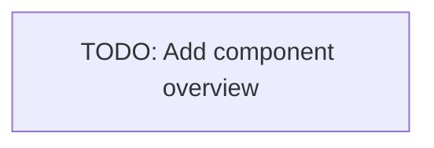

# Contributing

This guide will help you understand the overall organization of the project. It's the single source of truth for how to contribute to the code base.

> [!TIP]
> The key words "MUST", "MUST NOT", "REQUIRED", "SHALL", "SHALL NOT", "SHOULD","SHOULD NOT", "RECOMMENDED", "MAY", and "OPTIONAL" in this document are to be interpreted as described in [RFC 2119](https://tools.ietf.org/html/rfc2119).

## Setup

<!-- Setup rust  -->

## Components

> [!IMPORTANT]
> We will probably split this mono-repo into multiple ones to separate the different components and their responsibilities better, allow for easier maintenance and development, as well as ease license handling.

The project is organized into multiple components (crates), each with its own purpose and responsibilities.



<!-- TODO: Add short overview describing the main components purpose. -->

### Adding Components

New components SHOULD be added using `cargo new crates/${NAME}`. This will create a new crate directory with the standard Rust project structure.

After creating a new crate, you MUST link the appropriate license:

```sh
ln -s LICENSE-${TYPE} crates/${NAME}/LICENSE-${TYPE}
```

Where `${TYPE}` refers to the license type (e.g., `APACHE` for Apache-2.0).

Make sure to also update the license metadata in each crate's `Cargo.toml` file to correctly reflect the license being used:

```toml
[package]
# Other package metadata...
license = "${TYPE}"
```

The default license is Apache-2.0, but the project uses multiple licenses for the time being. If you're uncertain about which license to use, please consult the project lead. Make sure to use the SPDF license identifier, see  https://spdx.org/licenses/ for more information.

### Adding Dependencies

When adding dependencies, these MUST be added to the respective crate's `Cargo.toml` file. You can add dependencies using:

```sh
cargo add ${DEPENDENCY_NAME}
```

Make sure that the dependency is compatible with the project's licenses.

## Upgrade Dependencies

All dependencies SHALL be updated regularly to maintain an up to date and secure product. Updates SHOULD consider backward compatibility and MUST document compatibility issues.

<!-- TODO: Setup dependabot for automatic dependency updates and security updates and document configuration. -->

## Version Control

Changes SHOULD be committed frequently in small logical chunks that MUST be consistent, work independently of any later commits, and pass the linter plus the tests. Doing so eases rollback and rebase operations. Commits MUST not include any customer data.

Commit message SHALL follow the guidelines stated here, as they provide a framework to write explicit messages that are easy to comprehend when looking through the project history and enable automatic changelog generation. Commit messages MUST never include references to individual customer.

The Guidelines are based on
[AngularJS Git Commit Message Conventions](https://goo.gl/27wkkO).

This project uses `commitlint` to ensure that messages follow the guidelines.
Run `yarn install` in the project root to install the respective git hooks.

### Commit-Message

Each commit message MUST consist of a header (type, subject), a body
and a footer separated by empty lines:

```
<type>: <subject>

<message>

<footer>
```

Any line of the commit message MUST NOT be longer than 100 characters to ensure
that the messages are easy to read.

#### Subject

The subject contains a succinct description of the change. It SHOULD use the
imperative and present tense; “change” not “changed” nor “changes”.
The first letter SHALL NOT be capitalized, and MUST NOT end it with a dot.

#### Type

The following commit types are allowed:

- **feat** -
  use this type for commits that introduce new features or capabilities
- **fix** - use this one for bug fixes
- **docs** - use this one to indicate documentation adjustments and improvements
- **refactor** -
  use this type for adjustments to improve maintainability or performance
- **test** - use this one for commits that add missing tests
- **chore** - use this type for _maintainance_ commits e.g. removing old files
- **ci** - use this type for CI adjustments
- **style** - use this one for commits that fix formatting and linting errors

#### Message

The message SHOULD describe the motivation for the change and contrast it with previous behavior. It SHOULD use the imperative and present tense.

#### Referencing Issues

Closed issues MUST be listed on a separate line in the footer prefixed with
"Closes" keyword.

#### Breaking Changes

All breaking changes MUST be mentioned in the footer with the description of
the change, justification, and migration notes. Start the block explaining the
breaking changes with the words `BREAKING CHANGE:` followed by a space.

### Examples

```
fix: remove UI log statements

Remove console log statements to prevent IE4 errors.

Closes #123, #456
```

```
fix: gracefully handle HTTP connections

Gracefully handle 4xx and 5xx status codes to allow for retries when applicable.

Closes #123
```

```
feat: add new Graphana data sources

Introduce a new Graphana data source

Closes #123
```

```
refactor: change constant names

Adjust constant names, following the new naming conventions.

Closes #123
```

```
refactor: simplify video control interface

Simplify the video player control interface as the current
interface is somewhat hard to use and caused bugs due
to accidental misuse.

BREAKING CHANGE: VideoPlayer control interface has changed
to simplify the general usage.

To migrate the code follow the example below:

Before:

VideoPlayer.prototype.stop({pause:true})

After:

VideoPlayer.prototype.pause()
```
