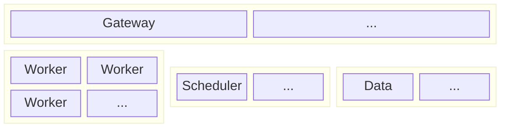

# Architecture Overview

Hypha's architecture combines decentralized networking with coordinated resource allocation to enable distributed machine learning at scale. This section explains how components interact and the protocols that connect them.

The system consists of four primary components connected through a peer-to-peer network:

## Gateway

Gateways provide stable entry points for the network. They serve three key functions:

**Network Bootstrap**: New nodes joining the network connect to gateways to discover other peers. Gateways maintain connections to well-known addresses listed in bootstrap configurations.

**NAT Traversal**: Nodes behind firewalls or NAT can use gateways as relays. The gateway forwards traffic between peers that cannot connect directly.

**DHT Stability**: By maintaining long-lived connections and stable addresses, gateways anchor the Kademlia DHT and improve routing table quality across the network.

Gateways participate in all network protocols (Kademlia, Gossipsub, request/response) but do not execute compute tasks or store data. They require minimal resources but benefit from public IP addresses and reliable connectivity. See the [libp2p Network Stack RFC](../rfc/2025-03-25-libp2p_network_stack.md) for details on the underlying P2P networking foundation.

## Scheduler

Schedulers orchestrate distributed training jobs. Their responsibilities include:

**Resource Discovery & Allocation**: Schedulers discover and allocate workers through a decentralized pub/sub mechanism (see the [Decentralized Resource Allocation Protocol RFC](../rfc/2025-08-04_decentralized_resource_allocation_protocol.md)). They publish resource requirements via Gossipsub on the `hypha/worker` topic, specifying needs like GPU, CPU, memory, executor types, and pricing. Workers respond with offers if they can satisfy the requirements. The scheduler collects these offers and selects the best matches using greedy selection (lowest price first) for straightforward resource allocation.

**Lease Management**: Maintaining resource reservations through periodic lease renewals. Leases prevent workers from accepting competing work while ensuring they release resources from failed schedulers automatically — guarding against zombie tasks that would otherwise be hard to detect or resolve in a decentralized system.

**Training Coordination**: Tracking worker progress and determining optimal synchronization points. The scheduler simulates future completion times based on reported batch processing speeds to minimize stragglers and respond to varying worker hardware characteristics. See the [Performance-Aware Scheduling RFC](../rfc/2025-10-16_performance_aware_scheduling.md) for details on handling heterogeneous hardware.

**Data Distribution**: Assigning dataset slices to workers and tracking which data has been processed. Slices transition through states (AVAILABLE → ASSIGNED → USED) to ensure complete dataset coverage. See the [Data Nodes RFC](../rfc/2025-10-07_data_nodes.md) for details on the data serving architecture.

**Metrics Collection**: Aggregating training metrics and optionally forwarding them to e.g. AIM for visualization.

Schedulers maintain state for active jobs.

## Worker

Workers execute training and inference tasks. Each worker implements several subsystems:

**Request Management**: Subscribes to advertisements on the `hypha/worker` topic and evaluates incoming requests against configurable criteria. The arbiter maintains a pricing threshold and only responds to requests meeting resource requirements and price expectations. When multiple schedulers compete for resources simultaneously, the evaluation system scores and ranks requests using configurable strategies — prioritizing profit maximization. See the [Decentralized Resource Allocation Protocol RFC](../rfc/2025-08-04_decentralized_resource_allocation_protocol.md) for details on the negotiation mechanism.

**Lease Manager**: Manages time-bounded resource reservations. When a worker sends an offer, it creates a temporary lease preventing double-booking. Accepted offers transition to renewable leases maintained through periodic renewal by the scheduler.

**Job Manager**: Executes confirmed jobs. The job manager spawns executor processes, provides them with work directories and communication sockets, and monitors execution.

**Executors**: Handle actual computation. Process executors run training scripts as subprocesses. Aggregate executors implement _parameter server_ functionality for DiLoCo synchronization. See the [Worker](worker.md) documentation for executor details.

**Job Bridge**: Provides a language-agnostic HTTP API over Unix sockets, allowing executors to fetch resources, send data to peers, and receive streams without understanding P2P protocols. See the [Job Bridge RFC](../rfc/2025-08-14_job_bridge.md) for the complete interface specification.

Workers can run multiple executors simultaneously, enabling diverse workload support on a single machine.

## Data

Data nodes serve slices from prepared datasets to workers on demand. See the [Data Nodes RFC](../rfc/2025-10-07_data_nodes.md) for the complete specification.

**Dataset Announcement**: Publishing available datasets to the Kademlia DHT. Schedulers query the DHT to locate data nodes serving required datasets.

**Slice Serving**: Streaming SafeTensors files containing dataset batches to workers. Data nodes support parallel serving to multiple workers.

Datasets are stored as SafeTensors files, which provide safe tensor deserialization, memory mapping support, and efficient streaming. While designed for model parameters, SafeTensors works well for preprocessed training data.

Data nodes require storage proportional to dataset size and network bandwidth for serving. They do not participate in training other than serving slices.

## Further Reading

The architecture described above was discussed and documented by several detailed RFCs that specify individual components and protocols:

* [Decentralized Resource Allocation Protocol RFC](../rfc/2025-08-04_decentralized_resource_allocation_protocol.md) — Pub/sub-based protocol for decentralized scheduler-worker matching, including message flow, lease management, and pricing mechanisms.
* [Job Bridge RFC](../rfc/2025-08-14_job_bridge.md) — Language-agnostic HTTP API enabling executors to fetch resources and communicate with the network without understanding P2P protocols.
* [Data Nodes RFC](../rfc/2025-10-07_data_nodes.md) — Architecture for serving prepared datasets via DHT announcement and SafeTensors streaming.
* [Performance-Aware Scheduling RFC](../rfc/2025-10-16_performance_aware_scheduling.md) — Two-phase scheduling system for heterogeneous hardware with adaptive DiLoCo synchronization points.
