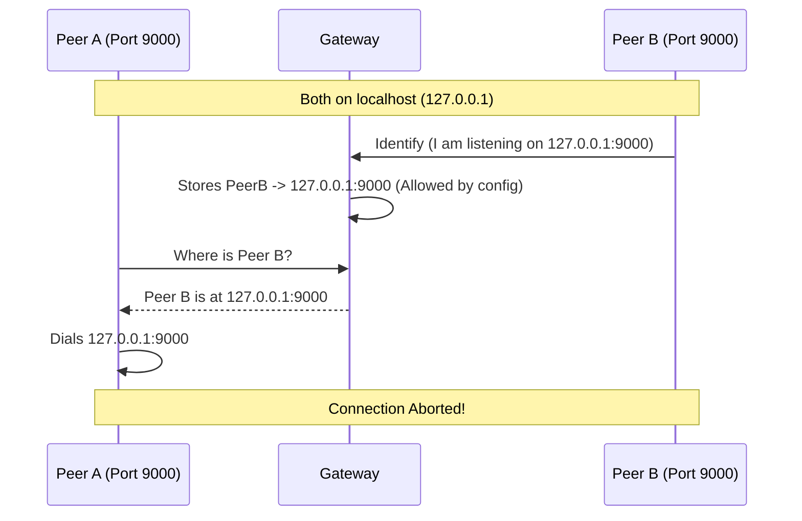

+++
title = "Multiple Nodes on Localhost or Private Network"
description = "Guide for running multiple peers on a single host or within the same private network."
[taxonomies]
track = ["onboarding"]
+++

# Running multiple Nodes on Localhost or the same Private Network

This guide explains how to configure Hypha when running multiple nodes (Worker, Scheduler, Gateway) on a single host or deploying a cluster within a private network (LAN/VPC).

While deploying a single node is straightforward, running multiple peers in close proximity requires careful configuration to ensure efficient communication. The default settings are designed for global safety, which can inadvertently force local traffic over the public Internet or through a relay, leading to poor performance and unnecessary costs.

## The Challenge: Performance vs. Safety

In a local host or private network scenario, your goal is speed and efficiency. If you have a Worker and a Data Node on the same machine, or a cluster of nodes within a VPC, they should communicate directly over the high-speed local interface (loopback or LAN). Sending terabytes of gradients or dataset slices over the public Internet, or worse, bouncing them through a Relay, is slow and incurs significant costs.

However, Hypha's default configuration prioritizes **safety** and **global routability**. By default, the system filters out "ambiguous" addresses, such as `127.0.0.1` (localhost) or `192.168.x.x` (private LAN), from the Distributed Hash Table (DHT). This is done to prevent **Self-Dialing accidents** and to ensure that a peer in Europe doesn't try to dial a peer in the US using it's private IP that happens to match its own local network.

**The Consequence:** Because these local addresses are filtered out, peers in the same private network never "learn" their direct addresses from the DHT. Consequently, they cannot dial each other directly and fall back to using the Gateway as a Relay. This solves connectivity but sacrifices the bandwidth and latency benefits of your local network.

## How Address Discovery Works

To understand why this happens, we must look at the [Identify protocol](https://github.com/libp2p/specs/tree/master/identify). When a peer connects to the Gateway (or any other peer), it announces all the addresses it is listening on, including local ones. It then decides which of the received  addresses to publish to the DHT for other peers to find.

This decision is controlled by the **Exclusion List (`exclude_cidr`)**. Before storing an address, the a peer checks if it falls within an excluded range. By default, peers excludes loopback (`127.0.0.0/8`) and private ranges (`10.0.0.0/8`, etc.). Therefore, even if your Worker shouts "I am at 192.168.1.5!", the exclusion list effectively silences this, ensuring no one else tries to dial that potentially confusing address.

## Enabling Direct Connections

To unlock high-speed local communication, you must adjust the `exclude_cidr` configuration to **allow** these private ranges. By removing `127.0.0.0/8` (for single-host) or private subnets (for VPCs) from the exclusion list, you allow the Gateway (and orher peers) to store and share these addresses. Peers can then discover their neighbors' local IP addresses and establish direct, non-relayed connections.

## The Risk: Self-Dialing

Adjusting the exclusion list re-introduces the risk that the defaults were designed to prevent: **Self-Dialing** (and dialing the wrong peers in general).

Self-dialing occurs when a peer mistakenly tries to connect to itself. This typically happens when multiple peers bind to the same ambiguous address (like `127.0.0.1`) and share a port configuration.



For example, if Worker A and Worker B both announce `127.0.0.1:9000`, and you have allowed `127.0.0.1` in the DHT, Worker A might query "Where is Worker B?" and receive `127.0.0.1:9000`. If Worker A dials this, it connects to itself. Hypha's will detect that the remote Peer ID matches the local Peer ID and immediately **abort the connection** to prevent DHT state corruption, making it impossible for Worker A to connect to Worker B.

## Recommended Configuration

To achieve direct local connections safely, you must adhere to two rules: **Relax the Exclusions** and **Ensure Unique Ports**.

### 1. Relaxing Exclusions

You must modify the `exclude_cidr` in your configurations to allow the addresses relevant to your setup.

*   **For Single Host:** Remove `127.0.0.0/8` from the list.
*   **For Private Network/VPC:** Remove the relevant private range (e.g., `10.0.0.0/8` or `192.168.0.0/16`).

### 2. Unique Ports 

Since you are now sharing local addresses, every peer binding to the _"same"_ interface **must** listen on a unique port. If multiple peers advertise `127.0.0.1` with the same port, they become indistinguishable at the network layer.

For localhost, the most robust approach is to configure all non-gateway peers (Schedulers, Workers) to use port `0`. This instructs the OS to assign a random, available ephemeral port, guaranteeing uniqueness.

```toml
listen_addresses = ["/ip4/127.0.0.1/tcp/0", "/ip4/127.0.0.1/udp/0/quic-v1"]
```
