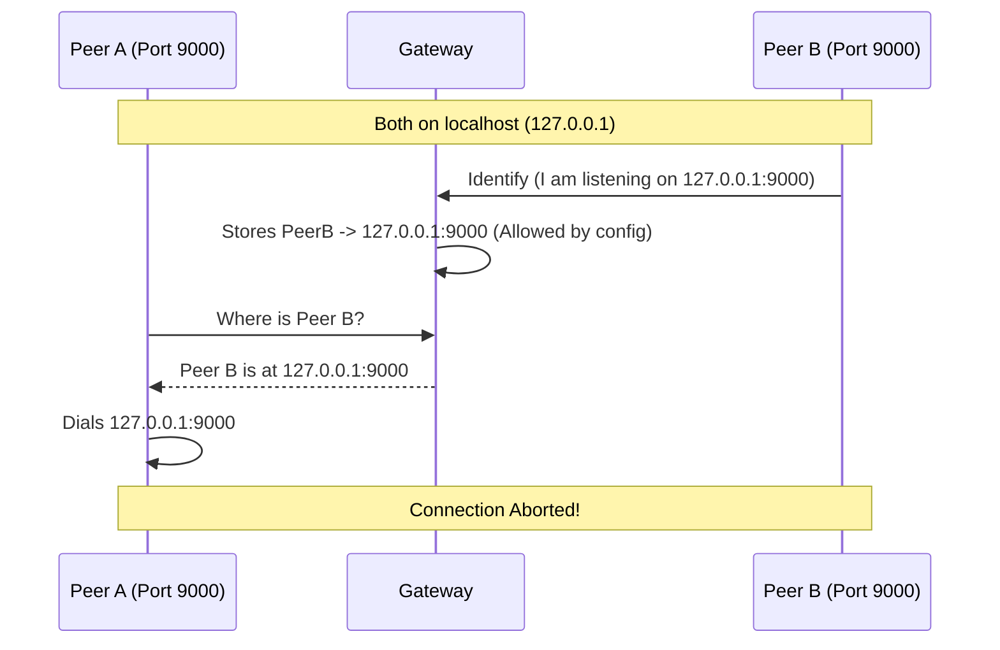

+++
title = "Multiple Nodes on Localhost or Private Network"
description = "Guide for running multiple peers on a single host or within the same private network."
weight = 10
[taxonomies]
track = ["onboarding"]
+++

# Running Multiple Nodes on Localhost or Private Network

This guide covers configuring Hypha when running multiple nodes (Worker, Scheduler, Gateway) on a single host or within a private network (LAN/VPC).

Running multiple peers in close proximity requires careful configuration to ensure efficient communication. Default settings prioritize global safety, which can inadvertently force local traffic over the public Internet or through a relay—resulting in poor performance and unnecessary costs.

## The Challenge: Performance vs. Safety

In a local host or private network scenario, the goal is speed and efficiency. A Worker and Data Node on the same machine, or a cluster of nodes within a VPC, should communicate directly over the high-speed local interface (loopback or LAN). Sending terabytes of gradients or dataset slices over the public Internet, or bouncing them through a relay, is slow and costly.

Hypha's default configuration prioritizes **safety** and **global routability**. By default, the system filters out "ambiguous" addresses such as `127.0.0.1` (localhost) or `192.168.x.x` (private LAN) from the Distributed Hash Table (DHT). This prevents **self-dialing accidents** and ensures that a peer in Europe does not try to dial a peer in the US using its private IP that happens to match its own local network.

**The consequence:** Because these local addresses are filtered out, peers in the same private network never "learn" their direct addresses from the DHT. They cannot dial each other directly and fall back to using the Gateway as a relay. This solves connectivity but sacrifices the bandwidth and latency benefits of your local network.

## How Address Discovery Works

To understand why this happens, look at the [Identify protocol](https://github.com/libp2p/specs/tree/master/identify). When a peer connects to the Gateway (or any other peer), it announces all addresses it is listening on, including local ones. The receiving peer then decides which addresses to publish to the DHT for other peers to find.

This decision is controlled by the **Exclusion List (`exclude_cidr`)**. Before storing an address, a peer checks if it falls within an excluded range. By default, peers exclude loopback (`127.0.0.0/8`) and private ranges (`10.0.0.0/8`, etc.). Even if your Worker announces "I am at 192.168.1.5!", the exclusion list silences this, ensuring no one else tries to dial that potentially confusing address.

For a deeper understanding of address discovery, see [Networking](@/networking.md).

## Enabling Direct Connections

To enable high-speed local communication, adjust the `exclude_cidr` configuration to **allow** private ranges. Remove `127.0.0.0/8` (for single-host) or private subnets (for VPCs) from the exclusion list. This allows the Gateway (and other peers) to store and share these addresses. Peers can then discover their neighbors' local IP addresses and establish direct, non-relayed connections.

## The Risk: Self-Dialing

Adjusting the exclusion list re-introduces the risk that the defaults were designed to prevent: **self-dialing** (and dialing the wrong peers in general).

Self-dialing occurs when a peer mistakenly tries to connect to itself. This typically happens when multiple peers bind to the same ambiguous address (like `127.0.0.1`) and share a port.



Example: Worker A and Worker B both announce `127.0.0.1:9000`, and you have allowed `127.0.0.1` in the DHT. Worker A queries "Where is Worker B?" and receives `127.0.0.1:9000`. If Worker A dials this, it connects to itself. Hypha detects that the remote Peer ID matches the local Peer ID and immediately **aborts the connection** to prevent DHT state corruption, making it impossible for Worker A to connect to Worker B.

## Recommended Configuration

Achieve direct local connections safely by following two rules: **relax the exclusions** and **ensure unique ports**.

### 1. Relaxing Exclusions

Modify `exclude_cidr` in your configurations to allow addresses relevant to your setup:

* **Single Host:** Remove `127.0.0.0/8` from the list
* **Private Network/VPC:** Remove the relevant private range (e.g., `10.0.0.0/8` or `192.168.0.0/16`)

### 2. Unique Ports

Since you are now sharing local addresses, every peer binding to the same interface **must** listen on a unique port. If multiple peers advertise `127.0.0.1` with the same port, they become indistinguishable at the network layer.

For localhost, the most robust approach is to configure all non-gateway peers (Schedulers, Workers) to use port `0`. This instructs the OS to assign a random, available ephemeral port, guaranteeing uniqueness.

```toml
listen_addresses = ["/ip4/127.0.0.1/tcp/0", "/ip4/127.0.0.1/udp/0/quic-v1"]
```

## Address Types

Understanding the three address types in Hypha configuration is essential for multi-node setups:

* `listen_addresses` — where a node **binds and accepts** incoming connections
* `gateways` — which peers (usually Gateways) a node **dials on startup**
* `external_addresses` — which addresses a node **advertises** to others for peer discovery

For detailed explanations and examples of each address type, including when to configure `external_addresses`, see [Networking: Address Types in Hypha Config](@/networking.md).

### When `external_addresses` Is Required

Configure `external_addresses` when a node has a different external IP than its internal IP **and** dials the Gateway using a local/private address. Common scenarios:

* Gateway and that node are on the same host
* Nodes that can only reach the Gateway via _localhost_

See [Networking: When You Must Set `external_addresses`](@/networking.md) for detailed examples.
