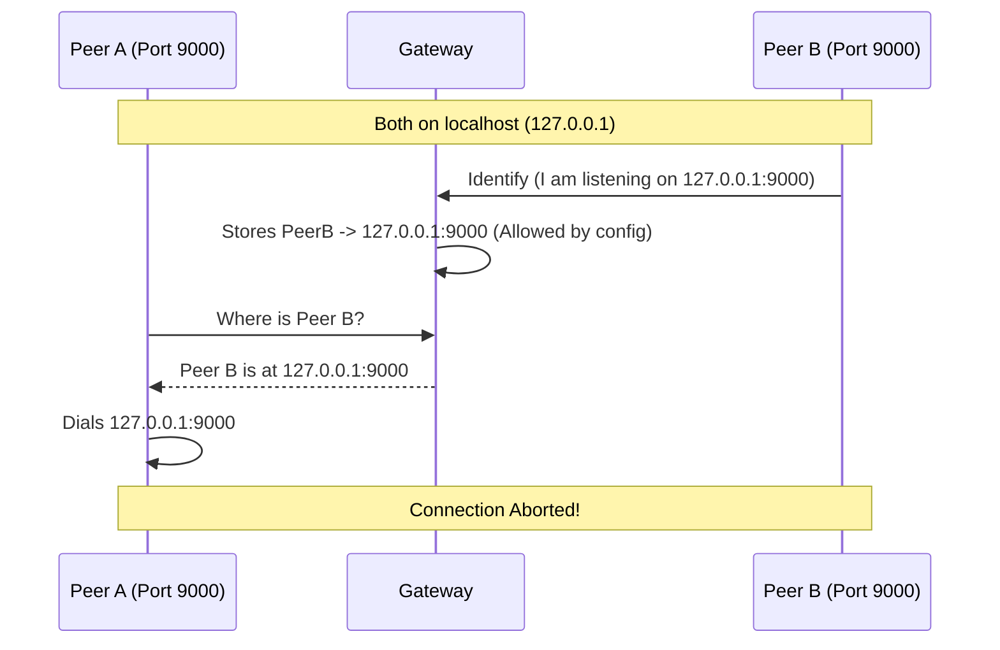

+++
title = "Networking"
description = "Explains how Hypha nodes discover and reach each other plus guidance on ports, NAT, and external addresses."
weight = 20
[taxonomies]
track = ["reference"]
+++

# Networking

Hypha is built on top of the libp2p networking stack and forms a peer-to-peer overlay network between gateways, schedulers, workers, and data nodes. This doc covers multiaddresses, Peer IDs, DHT-based discovery, and address configuration for NAT traversal.

## Identities and Addresses

Two core identity concepts underpin Hypha networking: **multiaddresses** and **Peer IDs**.

### Multiaddresses

Hypha uses [multiaddresses](https://multiformats.io/multiaddr/) ("multiaddrs") to describe network endpoints. A multiaddr is a path-like string that encodes protocol layers from left to right.

Examples:

- `/ip4/203.0.113.10/udp/8080/quic-v1`
- `/ip4/127.0.0.1/tcp/9090`
- `/dns4/gateway.example.com/udp/8080/quic-v1`
- `/ip6/2001:db8::1/tcp/8080`

The first one reads left to right:

1. `/ip4/203.0.113.10` — IPv4 address
1. `/udp/8080` — UDP port 8080
1. `/quic-v1` — QUIC v1 transport

Hypha currently supports:

* **Address families**
  * IPv4: `/ip4/<addr>/...`
  * IPv6: `/ip6/<addr>/...`
  * DNS: `/dns`, `/dns4`, `/dns6`
  
* **Transports**
  * TCP: `/tcp/<port>`
  * QUIC over UDP: `/udp/<port>/quic-v1`

### Peer IDs

Every Hypha node has a **Peer ID**, which is its logical identity within the network. It looks like this:

```text
12D3KooWJfDWPLaH5Nh2qkD4JJkTYmAyDeNtZVtuo7LkTXRJfPce
```

Key points:

* Peer IDs derive from the node's **certificate public key**. See [Security](@/security.md) for the underlying PKI design.
* Rotating certificates changes the Peer ID.
* Peers **dial Peer IDs**, not raw IPs. The DHT and identify handshake handle `peer-id → multiaddrs` routing.

  
> [!TIP] 
> Use [hypha-inspect](@/reference/hypha-inspect-cli.md) to get the up peer ID from a certificate:
>
> ```bash
> hypha-inspect cert-info /path/to/node-cert.pem
> ```
>
> This helps when you have certificates from a deployment and need to find the associated node in the network.

## Discovery and Routing: DHT and Identify

Hypha uses a Kademlia-style **Distributed Hash Table (DHT)** to route traffic and discover peers. Direct management is not required, but understanding the underlying behavior helps with debugging.

### DHT Basics

When a node starts:

1. It dials one or more **Gateways** listed under `gateways`.
2. Through the Gateways, it joins the Kademlia DHT.
3. It stores and looks up records in that DHT keyed by Peer ID or dataset name.

The DHT stores two kinds of information:

* **Peer routing records**: `PeerID → list of multiaddrs` (how to reach a node)
* **Provider records**: `dataset name → which peers provide it` (used by Data Nodes and Schedulers)


> [!NOTE]
> Records have a **time-to-live (TTL)** to keep the DHT fresh. Peer address records use a short TTL ( ~5 minutes). Nodes refresh their own presence periodically.
>
> If you suspect stale routing information, see [Troubleshooting](@/troubleshooting.md) for inspection and probing tools.

### Identify Handshake and Address Learning

When node **A** connects to node **B** (i.e. Gateway):

1. A dials B using a multiaddr (from config or DHT).
2. After the TLS handshake, libp2p runs the **identify** protocol.
3. During identify, A sends B its Peer ID and the list of addresses it considers valid for itself.
4. B uses that information to update A's entry in its local routing table and in the DHT.

This is where `exclude_cidr` and address filtering apply:

* The **callee** (B) decides which of A's addresses to keep and publish.
* Addresses that fall into `exclude_cidr` are filtered out before being written to the DHT.
* The stored addresses are what other peers dial when connecting to Peer ID A.

> [!NOTE]
> The callee decides which of the caller's addresses to publish. This behavior can feel counterintuitive. The public interface (`exclude_cidr`, `external_addresses`) remains the primary configuration mechanism.

## Address Types in Hypha Config

Hypha configuration uses three address concepts:

* `listen_addresses` — where a node **binds and accepts** incoming connections
* `gateways` — which Gateways a node **dials on startup** to bootstrap into the network
* `external_addresses` — which addresses a node **explicitly advertises** to others for discovery

Understanding the difference is essential for complex setups e.g. when multi-node run within a private network or on a single-host and NAT traversal.

### Listen Addresses

`listen_addresses` define the interfaces and ports the node binds to.

Common patterns:

* `127.0.0.1` / loopback — only reachable from the same machine
* `10.x.x.x`, `192.168.x.x`, `172.16-31.x.x` — private network ranges
* `0.0.0.0` — bind on all interfaces on this host

Example (localhost):

```toml
listen_addresses = [
  "/ip4/127.0.0.1/tcp/0",
  "/ip4/127.0.0.1/udp/0/quic-v1",
]
```

> [!IMPORTANT]
> A listen address tells Hypha **where to listen**, not how other nodes reach that node. Binding to `0.0.0.0` or a private IP does not automatically make it reachable from the Internet, it just means "accept packets that arrive at this interface and port".

### Gateway Addresses

`gateways` lists the Gateway peers a node dials on startup. This bootstraps the node into the DHT and provides initial routes to other peers.

Example:

```toml
gateways = [
  "/ip4/203.0.113.10/udp/8080/quic-v1",
]
```

When a node connects to a Gateway, the Gateway:

* Provides bootstrap (DHT, relays, pub/sub)
* Learns the node's address during the identify handshake (similar to STUN)

This works best when the node dials the Gateway using a **routable** address. If it connects via a private address, the Gateway only sees that internal address, in this case you must configure an external address for the node so that nodes outside the private network can reach it.

### External Addresses

`external_addresses` is an **optional** list of addresses that a node explicitly advertises for peer discovery.

> [!IMPORTANT]
> Only list addresses reachable from other peers (e.g. public IP, DNS).

```toml
external_addresses = [
  "/ip4/1.2.3.4/udp/8080/quic-v1",
]
```

These addresses are:

* Shared via the DHT and peer routing
* Used by other nodes to dial this node directly

In many deployments, `external_addresses` is unnecessary. Hypha can usually infer addresses from how you dial the Gateway.


#### When You Do Not Need `external_addresses`

In many standard deployments, skip `external_addresses` entirely:

* One node per machine
* The node dials a Gateway using a **routable** address
* At least one Gateway has a public address and is reachable from the node

In this case:

1. The node opens an outbound connection to the Gateway from its external address.
2. The Gateway sees that address during identify.
3. The Gateway publishes it into the DHT.

No manual `external_addresses` required.

#### When You Must Set `external_addresses`

Configure `external_addresses` when the network cannot otherwise learn a routable address for your node.

Specifically, set `external_addresses` if **all** of the following are true:

1. The node has a different **external IP** than its internal IP (NAT, port-forward, load balancer, etc.).
2. The node dials the Gateway using a **local/private** address (e.g., `127.0.0.1`, `10.x.x.x`, `192.168.x.x`).
3. No other peer or service sees the node's external IP directly (no public gateway connection, no other STUN-like path).

In that situation:

* Gateways and other peers only see the node's internal addresses
* Those addresses are not reachable from the outside
* The DHT has no way to learn a valid external address for the node
* To make the node reachable, declare that address via `external_addresses`

#### Example: Gateway and Data Node on the Same Host

Scenario:

* Gateway and Data Node run on the **same machine**
* Firewall rules only allow the Data Node to talk to the Gateway via `127.0.0.1` or `10.x.x.x`
* The machine has a public IP `1.2.3.4`

Configuration:

```toml
# data-config.toml

listen_addresses = [
  "/ip4/10.x.x.x/udp/8080/quic-v1",
]

gateways = [
  "/ip4/10.x.x.x/udp/9090/quic-v1",
]

external_addresses = [
  "/ip4/1.2.3.4/udp/8080/quic-v1",
]
```

* The Data Node listens on `10.x.x.x:8080`
* It dials the local Gateway on `10.x.x.x:9090`, so the Gateway only sees `10.x.x.x`
* The Data Node **must** advertise `/ip4/1.2.3.4/udp/8080/quic-v1` via `external_addresses`
* Other nodes discover and dial the Data Node on `1.2.3.4:8080`

## `exclude_cidr` and Self-Dials

Hypha nodes can have multiple addresses: loopback, LAN, public, etc. Not all should be shared or used for dialing.

The `exclude_cidr` setting tells a node **which CIDR ranges to ignore** when deciding what to publish for other peers during the identify/DHT update.

Typical uses:

* Avoid leaking internal ranges into a federated network
* Avoid **self-dials** when running multiple nodes on one host

### What Are Self-Dials?

A self-dial happens when a node looks up "Peer X" in the DHT and one of the returned addresses points back to **itself** unexpectedly. This typically occurs when multiple peers bind to the same ambiguous address (like `127.0.0.1`) and share a port.



Example: Worker A and Worker B both announce `127.0.0.1:9000`, and you have allowed `127.0.0.1` in the DHT. Worker A queries "Where is Worker B?" and receives `127.0.0.1:9000`. If Worker A dials this, it connects to itself. Hypha detects that the remote Peer ID matches the local Peer ID and immediately **aborts the connection** to prevent DHT state corruption—making it impossible for Worker A to connect to Worker B.

Self-dials can:

* Create confusing connection loops
* Break some protocols
* Make debugging network issues difficult

`exclude_cidr` helps reduce this risk by filtering out addresses that would be poor candidates for other peers to dial. For detailed configuration guidance, see [Multiple Nodes on Localhost or Private Network](@/deploy/local_multi_node.md).

### How Filtering Works

Recall the identify handshake:

* A connects to B
* A tells B "these are my addresses"
* **B** filters A's addresses using its own `exclude_cidr` and writes the remaining ones into the DHT

Result:

* The callee's `exclude_cidr` (B) controls what ends up in the DHT for the caller (A)
* When other nodes look up A's Peer ID, they get addresses that have already passed through this filter

> [!NOTE]
> The mental model above is accurate for current releases. Future versions may refine how address filtering interacts with `exclude_cidr`.

## Verifying Connectivity

When something seems off, use the tools in [Troubleshooting](@/troubleshooting.md) to inspect network state.

### Look up a Peer's Addresses

Use the Peer ID (from logs or `cert-info`) to query the DHT:

```bash
hypha-inspect lookup --config worker.toml 12D3KooWExamplePeerId
```

This shows which addresses are currently advertised for that peer. If they look wrong (e.g., `127.0.0.1` for a node that should be remote), revisit:

* `listen_addresses`
* `external_addresses`
* `exclude_cidr`
* How the node dials Gateways

DHT records have a short TTL; changes can take a few minutes to propagate.

### Probe a Peer

With a candidate address, check whether the target is reachable and healthy:

```bash
hypha-inspect probe --config worker.toml /ip4/203.0.113.10/udp/8080/quic-v1
```

If the probe succeeds, you see a brief summary. If it fails:

* Verify firewall and security group rules
* Confirm the node is running and listening on that address
* Re-check `external_addresses`/`exclude_cidr` and your NAT/port forwarding setup
