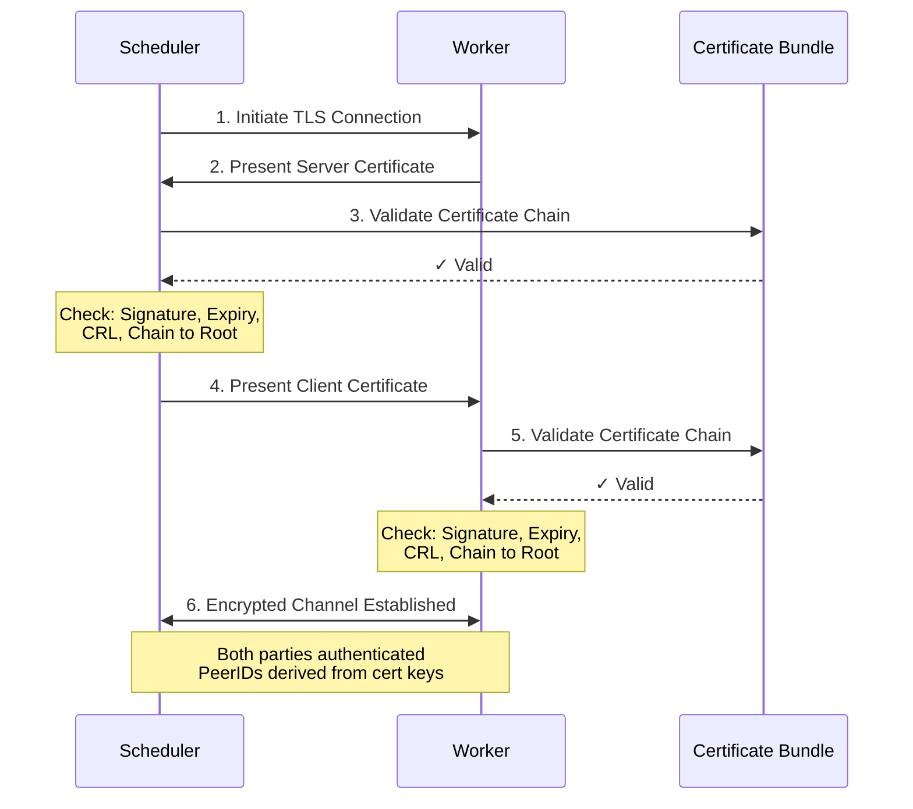

# Security

Hypha implements mutual TLS (mTLS) authentication and certificate-based access control.

## mTLS Setup

Mutual TLS provides bidirectional authentication where both client and server verify each other's identities using certificates signed by a trusted Certificate Authority.

### Certificate Authority Infrastructure

Hypha uses a three-or-more-tier certificate hierarchy built on standard PKI principles. At the top sits the Root CA, which serves as the ultimate trust anchor and whose private key must be kept highly secured. Organizations should use an optional Intermediate CA, issued by the root, to handle day-to-day certificate signing operations. This separation provides operational flexibility and security resilience, since compromise of an intermediate CA doesn't require root key rotation. Individual node certificates are issued for each Hypha component—gateways, schedulers, workers, and data nodes—establishing cryptographically verifiable identities throughout the network.

**Hierarchy Example**:
```
Root CA
 └── Intermediate CA (Organization)
      ├── Gateway-01 Certificate
      ├── Gateway-02 Certificate
      ├── Scheduler-01 Certificate
      ├── Worker-01 Certificate
      ├── Worker-02 Certificate
      └── Data-01 Certificate
```

### Certificate Requirements

Hypha enforces strict certificate requirements to ensure compatibility with enterprise PKI systems. All certificates must use Ed25519 keys in PKCS#8 format for private keys and standard X.509 PEM encoding for certificates. Self-signed certificates are explicitly not supported—every node certificate must be signed by a trusted CA. Certificate validity periods should be kept reasonably short (typically 90 days to 1 year) to improve security through regular rotation. Unlike standard libp2p implementations that rely on custom X.509 extensions to carry peer identity, Hypha uses standard certificates without any extensions, maintaining full compatibility with traditional PKI tooling and infrastructure.

### Certificate Generation

> [!WARNING]
> Always use established PKI solutions for production deployments. These solutions provide the security controls, scalability, automated rotation, and audit capabilities required for production environments.

For development and testing, Hypha provides `hypha-certutil` to generate certificates. This tool creates the three-tier certificate hierarchy (Root CA → Organization CA → Node certificates) but is not designed for production use.

See the [hypha-certutil CLI Reference](reference/hypha-certutil-cli.md) for detailed usage and examples.

## Node Authentication Flow

Hypha uses mutual TLS (mTLS) for bidirectional authentication, where both client and server nodes verify each other's identities using CA-signed certificates before establishing secure connections.



Both nodes perform certificate chain validation using the battle tested rustls `WebPkiClientVerifier`, which verifies that certificates are signed by a trusted CA, have not expired, are not listed in the Certificate Revocation List (CRL), and are properly formatted according to X.509 standards. Unlike standard libp2p implementations that maintain separate stable identity keys, Hypha derives PeerIDs directly from certificate public keys using the formula `PeerID = multihash(certificate_public_key)`. This architectural choice means that PeerIDs change whenever certificates are rotated, a trade-off accepted for simplified key management and stronger alignment with traditional PKI practices. Following libp2p conventions, Server Name Indication (SNI) is disabled during the TLS handshake, which simplifies the implementation and maintains compatibility with libp2p's extensibility requirements.

For complete details on the mTLS implementation, design rationale, security considerations, and comparison with standard libp2p, see the [mTLS RFC](../../rfc/2025-05-30_mtls.md).
