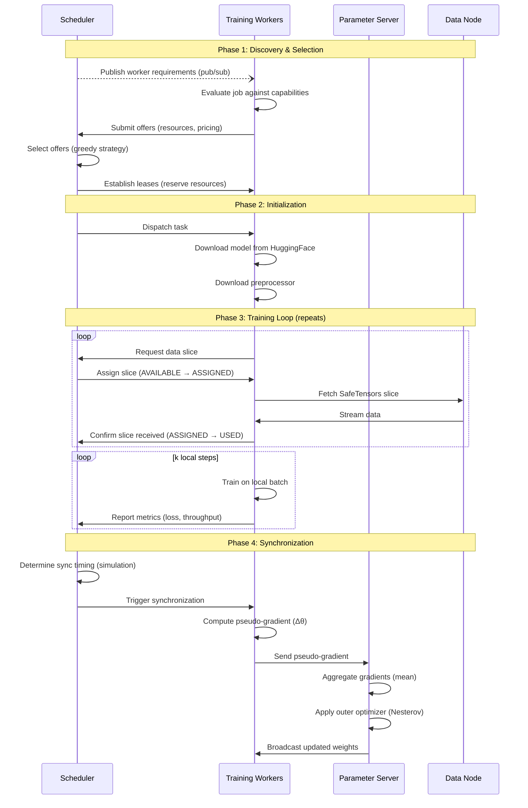

# DiLoCo Training

This guide explains how to set up and run distributed training in Hypha using the DiLoCo (Distributed Low-Communication) based algorithm. It covers the training workflow andconfiguration. For initial setup, see [Installation](installation.md) and [Quick Start](quick-start.md).

## Overview

DiLoCo is an approach that enables efficient training across geographically distributed and poorly-connected infrastructure. It achieves comparable performance to traditional synchronous training while drastically reducing communication.

### What You'll Do

To run a training job, you will:

1. Start a **data node** to serve your dataset
2. Launch **training workers** that perform local optimization steps
3. Start a **parameter server worker** that aggregates updates
4. Configure and run the **scheduler** to orchestrate the job

### How It Works

DiLoCo uses a two-level optimization strategy:

- **Inner loop (local)**: Each worker performs k local training steps using standard gradient descent (AdamW)
- **Outer loop (global)**: A parameter server aggregates pseudo-gradients (weight deltas) from all workers and applies Nesterov momentum to update the global model

This approach dramatically reduces network traffic because workers only synchronize after hundreds of local steps rather than after every batch.

## Roles and Workflow

Understanding each component's role helps diagnose issues and optimize performance.

### Components

**Data Node** ([docs/data.md](data.md))

- Serves dataset slices in SafeTensors format
- Announces dataset availability via DHT provider records
- Streams data to workers on demand

**Training Workers** ([docs/worker.md](worker.md))

- Run the `diloco-transformer` executor
- Perform k local optimization steps
- Report metrics and send pseudo-gradients to parameter server

**Parameter Server Worker** ([docs/worker.md](worker.md))

- Runs the `parameter-server` executor
- Aggregates pseudo-gradients from training workers
- Applies outer optimizer (Nesterov momentum)
- Broadcasts updated model weights

**Scheduler** ([docs/scheduler.md](scheduler.md))

- Advertises job requirements via pub/sub
- Matches workers to tasks based on resources and pricing
- Coordinates synchronization timing
- Tracks data slice assignment and progress

### Execution Flow

A DiLoCo training job progresses through several phases, from initial resource discovery to the iterative training loop. The scheduler orchestrates the entire workflow, coordinating between training workers, the parameter server, and data nodes. The process begins with workers bidding on tasks based on their capabilities and pricing, followed by initialization where workers download models and data. Once training begins, workers perform local optimization independently, periodically synchronizing through the parameter server to update the global model. Throughout this process, the scheduler continuously manages resource leases and tracks data slice usage to ensure efficient utilization and prevent conflicts.



## Data Distribution

Efficient data loading and distribution is critical for training throughput. Datasets are provided in slices via data nodes. You need to prepare your data by slicing it and store them in the SafeTensors format, fast loading:

```python
from safetensors.torch import save_file
import torch

# Vision data example
def save_vision_slice(images, labels, output_path):
    tensors = {
        "images": torch.stack(images),  # [N, C, H, W]
        "labels": torch.tensor(labels),  # [N]
    }
    save_file(tensors, output_path)

# Language data example
def save_language_slice(input_ids, attention_masks, output_path):
    tensors = {
        "input_ids": torch.tensor(input_ids),      # [N, seq_len]
        "attention_mask": torch.tensor(attention_masks),  # [N, seq_len]
    }
    save_file(tensors, output_path)
```

See [Data](data.md) for complete dataset preparation instructions and how to serve the prepared dataset. Once readay, start your data node to serve the dataset:

```bash
hypha-data run -c config.toml
```

## Training Workers

Training workers perform the core computation of the DiLoCo algorithm. Each worker begins by advertising its resources and executor capabilities to the scheduler, then receives job configuration via the Job Bridge socket. Once configured, the worker downloads the model and preprocessor from HuggingFace and begins fetching data slices from the data node. The worker then trains for k local steps using the inner optimizer (AdamW), continuously reporting metrics such as loss and throughput to the scheduler. After completing its local training steps, the worker computes and sends pseudo-gradients (weight deltas) to the parameter server, receives the updated global weights, and repeats the cycle.

Configure workers to run the DiLoCo training executor:

```toml
[[executors]]
class = "train"
name = "diloco-transformer"
runtime = "process"
cmd = "uv"
args = [
    "run",
    "--python", "3.12",
    "--no-project",
    "--with", "https://github.com/hypha-space/hypha/releases/download/v<version>/hypha_accelerate_executor-<version without semver channel or metadata>-py3-none-any.whl",
    # Optional: add `--extra`, "<variant>" here to pin a specific torch build (see docs below)
    "--", # N.B. this standalone `--` is the separator between `uv` opts and the cmd to be executed
    "accelerate",
    "launch",
    "--config_file", "<path/to/accelerate.yaml>",
    "-m", "hypha.accelerate_executor.training",
    "--socket", "{SOCKET_PATH}",
    "--work-dir", "{WORK_DIR}",
    "--job", "{JOB_JSON}",
]
```

See [Worker](worker.md) for complete worker configuration.

## Parameter Server

The parameter server aggregates updates from training workers and maintains the global model state. It waits for pseudo-gradients from all workers (with a configurable timeout), then aggregates them by computing their mean. The server applies the outer optimizer using Nesterov momentum, where `velocity = momentum × velocity_prev + Δθ_avg` and `update = learning_rate × (momentum × velocity + Δθ_avg)`, updating the global model as `θ_global = θ_global + update`. Finally, it broadcasts the updated model weights to all workers to begin the next training cycle.

Run a dedicated worker with the parameter server executor:

```toml
[[executors]]
class = "aggregate"
name = "parameter-server"
runtime = "parameter-server"
```

The parameter server can be colocated with training workers or run separately.

## Scheduler

The scheduler orchestrates the entire training workflow and manages resource allocation. It publishes job requirements via pub/sub and evaluates worker offers based on a pricing strategy such as greedy selection or lowest price. Once workers are selected, the scheduler establishes leases to reserve resources and prevent double-booking. Throughout training, it continuously tracks worker performance metrics including batch processing times and throughput, using this data to determine optimal synchronization timing through simulation. The scheduler also manages data slice assignment and epoch progression while forwarding metrics to monitoring systems like AIM and OpenTelemetry.

### Performance-Aware Scheduling

The scheduler adapts to heterogeneous workers by tracking per-worker batch processing times and allocating different batch counts based on each worker's speed. It simulates future progress to determine optimal synchronization points, minimizing the time faster workers spend waiting for stragglers.

### Configuration

Define your training job and start the scheduler.

```toml
[scheduler.job]
dataset_name = "my-dataset"  # Must match data node announcement

[scheduler.job.model]
repository = "microsoft/resnet-50"
type = "vision-classification"
# For private models:
# token = "hf_..."

[scheduler.job.preprocessor]
repository = "microsoft/resnet-50"

[scheduler.job.inner_optimizer]
learning_rate = 0.001
schedule = "cosine-with-warmup"
warmup_steps = 2000
total_steps = 500000

[scheduler.job.outer_optimizer]
learning_rate = 0.7
momentum = 0.9
```

### Resource Requirements

Specify minimum worker requirements:

```toml
[scheduler.job.resources]
min_memory_mb = 8192
min_gpus = 1
gpu_type = "nvidia"  # or "amd", "any"
```

### Model Types

**Vision Classification**:

```toml
[scheduler.job.model]
repository = "microsoft/resnet-50"
type = "vision-classification"
```

Uses `AutoModelForImageClassification.from_pretrained()`.

All HuggingFace models compatible with the Auto classes are supported. See the [HuggingFace documentation](https://huggingface.co/docs/transformers/model_doc/auto) for details.

See [docs/scheduler.md](scheduler.md) for complete configuration reference.

## Monitoring and Metrics

### AIM Integration

If you want the Scheduler to send metrics to AIM, you can download and set up our AIM Driver Connector from our [releases page](https://github.com/hypha-space/hypha/releases). Please follow its instructions to set up the connector and scheduler.

After that, configure the scheduler to expose metrics for AIM:

```toml
[scheduler]
status_bridge = "0.0.0.0:61000"
```

Once set up and running, **access dashboard** at `http://localhost:43800` (default) to view:

- Loss curves over time
- Throughput (samples/second)
- Synchronization frequency
- Worker utilization

## Algorithm Details

This section provides technical details of the DiLoCo algorithm for those who want to understand the implementation.

### Inner Optimization Loop

Workers train locally for k steps using their assigned data:

```python
# Initialize from parameter server
θ_worker = receive_from_parameter_server()
θ_initial = θ_worker.clone()

# Local training for k steps
for step in range(k):
    batch = fetch_data_from_data_node()
    loss = forward_pass(model, batch)
    gradients = backward_pass(loss)
    θ_worker = inner_optimizer.step(θ_worker, gradients)  # AdamW

    report_metrics(loss, batch_size)

# Compute pseudo-gradient
Δθ = θ_worker - θ_initial
send_to_parameter_server(Δθ)
```

**Key Points**:

- Each worker maintains its own model copy
- Inner optimizer (AdamW) applies standard gradient descent
- Workers process different data slices (data-parallel)
- Pseudo-gradient is the total weight change over k steps

### Outer Optimization (Parameter Server)

The parameter server aggregates and applies Nesterov momentum:

```python
# Wait for all workers (with timeout)
pseudo_gradients = [Δθ_1, Δθ_2, ..., Δθ_N]

# Average pseudo-gradients
Δθ_avg = mean(pseudo_gradients)

# Apply Nesterov momentum
velocity = momentum × velocity_prev + Δθ_avg
update = learning_rate × (momentum × velocity + Δθ_avg)

# Update global model
θ_global = θ_global + update

# Broadcast to workers
broadcast_to_workers(θ_global)
```

**Key Points**:

- Simple averaging provides unweighted aggregation
- Nesterov momentum accelerates convergence
- Updated model becomes starting point for next inner loop
- Timeout prevents indefinite waiting for stragglers

### Performance-Aware Synchronization

The scheduler uses simulation to determine optimal sync timing:

```python
def project_completions(workers, target_data_points):
    """Simulate worker progress to find optimal sync point."""
    updates_per_worker = {w: 0 for w in workers}
    next_completion_time = {w: w.avg_batch_time for w in workers}
    current_time = 0
    data_processed = 0

    while data_processed < target_data_points:
        # Find worker finishing next batch
        next_worker = min(workers, key=lambda w: next_completion_time[w])
        current_time = next_completion_time[next_worker]

        # Record completion
        data_processed += next_worker.batch_size
        updates_per_worker[next_worker] += 1
        next_completion_time[next_worker] += next_worker.avg_batch_time

    return current_time, updates_per_worker

def should_schedule_sync(workers, target_remaining):
    """Decide whether to trigger synchronization now."""
    time_to_complete, updates = project_completions(workers, target_remaining)
    slowest_worker_time = max([
        updates[w] × w.avg_batch_time for w in workers
    ])
    threshold = 5 * 60  # 5 minutes
    return slowest_worker_time < threshold
```

**Benefits**:

- Minimizes idle time for fast workers
- Better utilization of heterogeneous resources
- Automatic adaptation to changing conditions
- No manual per-worker tuning required
