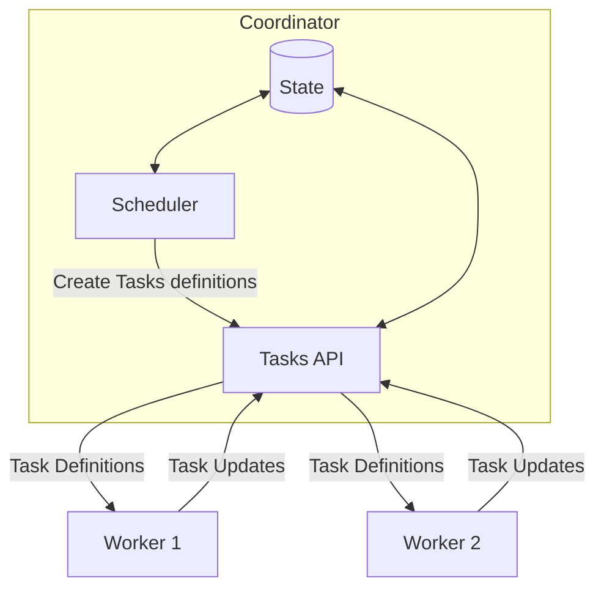

# Hypha API



## Coordinator to worker communication API

Data-parallel training and inference can be described by a list of tasks where some tasks depend on the results of other tasks.
Therefore, coordinator-to-worker communication API communicates these tasks. What these tasks should be and what they depend on is determined by the coordinator. How they are executed is determined by the worker.
Workers subscribe to the coordinator's stream of tasks. When scheduling a job, the coordinator decides which tasks to schedule based on the available resources and roles of workers and the dependencies between tasks and adds them to the stream.
Workers receive tasks from the coordinator and execute them. Workers send task status updates to the coordinator.
This is similar to the Kubernetes API and how it manages pods on kubelets. The different scheduling strategies (e.g., data-parallel inference, DiLoCo-based training) are handled by different implementations, similar to Kubernetes operators.

The difference between Hypha's tasks and Kubernetes' pods is that tasks depend on the results of other tasks, while pods are independent units of work.
I.e. these results (e.g., model weights, intermediate data) with can be inputs or outputs need to be referenced in the task definition and worker's need a mechanism to share them with each other.
Furthermore, the different scheduling strategies impose different roles on the workers. For example, with DiLoCo, some workers are responsible for data aggregation and others for model training.
The actual resource sharing mechanism is handled by different implementations. E.g., some resources can be shared via S3, while others can be shared via a shared file system, or through direct access via a peer-to-peer network.
Peer-to-peer sharing could look like this: An API separate from the coordinator-worker communication API is needed to facilitate communication between workers. Though, since workers are already connected to the coordinator, the same communication channel could be used for both.
If a worker isn't able to directly access a resource that's referenced in a task, it can request the resource from that API. Depending on their roles, workers are then either be instructed to push the resource to the requesting worker or to pull the resource from the resource-holding worker.

## Example task definition

```json
{
  "name": "task1",
  "driver": {
    "pytorch": {
      "dataset": "dataset",
      "model": "model",
      ...
    },
  },
  "resources": [
    {
      "name": "dataset",
      "s3": {
        "bucket": "my-bucket",
        "key": "data.csv"
      }
    },
    {
      "name": "model",
      "dht": {
        "sha256": "abcdef1234567890"
      }
    }
  ]
}
```
