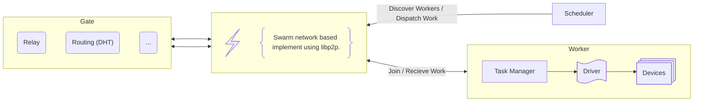

# Decentral Scheduling

<!--
NOTE: Choose a short, memorable title for your RFC. Prefix the title with the
current/creation date (YYYY-MM-DD) and use the full title as the file name for
your RFC. Use snake_case for the title - make sure all words are separated
by underscores. This ensures consistency and avoids a disorganized repository.

Example: `2023-04-20_improved_authentication_system.md`
-->

## Overview

<!--
NOTE: Provide a brief overview in one or two paragraphs.

- What is the goal/intent of this RFC?
- What challenge/problem does it address?
- Who is it for? Who are the stakeholders?
-->

This RFC proposes a decentralized scheduling mechanism for task distribution. The goal is to shift from traditional global _worker-driven_ job allocation to a model where tasks are derived directly from job requirements. By assessing resource needs upfront and using a distributed hash table (DHT) to locate appropriate workers, the system can dynamically match tasks with resources without the need for centralized coordination. This design supports bring-your-own-hardware deployments and can help reduce infrastructure costs—especially in GPU-intensive environments.

## Background

<!--
NOTE: Provide a description of the motivation behind this project.

- What problem or challenge does it address?
- Who is going to benefit from the project, and how?
- How will people interact with project?
- Who are the stakeholders?
- Is this related to prior RFCs, discussions?
- Are there any technical requirements?
-->

Traditional scheduling systems often start with worker availability, using bin packing algorithms to schedule work based on available resources. In contrast, a decentralized scheduling approach begins by breaking down the job into discrete tasks and analyzing the resource requirements from the outset. The system then uses a DHT-based query to find workers that match these resource profiles. Once a worker is identified and commits to the task, the system enters a standard execution loop, ensuring efficient task dispatch and execution.

## Proposal

<!--
NOTE: Given the background, propose a solution in this section. Provide an
overview of the "how" for the solution.

- How will people interact with project based on this proposal? Make sure to
  provide diagrams (mermaid), pseudo code, and/or visual designs.
- How are we going to execute the project? Is there anything that need to
  happen first?
- How does it fit into the existing (technical) design?
-->
The proposal is to implement a decentralized scheduler that performs the following key steps:

1. **Task Derivation and Resource Profiling**: Tasks are first derived from the job specification and then resource requirements (e.g., CPU, GPU, memory) are identified upfront.

2. **Worker Discovery via DHT Query**: Using a distributed hash, the scheduler queries for workers that match the resource profile. We should be able to utilize Kademlia as provided via libp2p to locate and validate potential worker nodes.

3.	**Commit and Dispatch**: Once suitable workers are identified, they commit upon request (when the scheduler meets scheduling criteria). The scheduler then dispatches the tasks following a standard task execution loop. The worker’s local task manager and driver handle task execution on the underlying devices.

_Asside: We'll be able to implement job priorities and authz via this negotiation process._




Pseudo-code outline for the scheduler:

```rs
// 1. Derive tasks and resource profiles from the incoming job
let tasks = derive_tasks(job);
let required_resources = assess_resources(tasks);

// 2. Query the DHT for suitable workers
let available_workers = dht_query(required_resources);

// 3. For each task, select a worker that has committed
for task in tasks {
    if let Some(worker) = select_worker(available_workers, task) {
        dispatch_task(worker, task);
    }
}

// 4. Monitor task execution and handle completion
//...
```
<!-- ## Abandoned Ideas (Optional) -->

<!--
NOTE: Document abandoned ideas and explain why they were abandoned. This helps
future readers avoid pitfalls and understand the thought process behind the
current proposal.
-->

<!--
NOTE: From this point onwards, the sections and headers are generally freeform
depending on the RFC.

Use `h2` (`##`) style for sections. Aim to create well-organized sections that address
important questions, and arrange them in a sequence that helps readers build
their understanding without having to jump around for context.

This RFC template is based on the RFC template used by Hashicorp and similar templates used by other organizations.

https://www.hashicorp.com/en/how-hashicorp-works/articles/rfc-template

It may be useful to refer to their examples and best practices when writing a proposal.
-->
