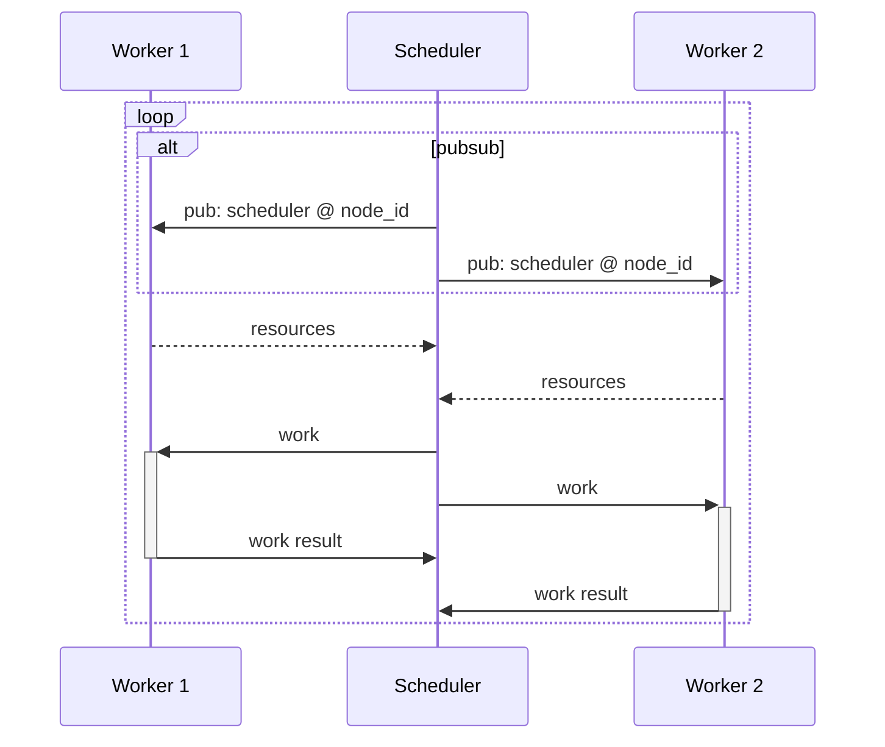

# Peer-to-peer Resource Discovery Protocol

## Overview

To schedule composite learning workloads on a heterogenous set of worker nodes, a scheduling algorithm needs to know the available resources of each worker node.
A publish-subscribe mechanism is used to discover the resources of each worker node.
With this approach, scheduling algorithms can efficiently discover available resources with minimal overhead.

## Background

In composite learning, data-parallel and model-parallel algorithms are used to train large-scale machine learning models. To use available compute resources efficiently, scheduling algorithms like [DiLoCo](https://arxiv.org/abs/2311.08105) need to know the available resources of each worker node.
In centralized environments, a scheduler can act as a server that each worker node connects to and reports its resources. As an alternative to decouple schedulers from a server, a message-oriented architecture can be used to discover the resources of each worker node: A scheduler would announce a scheduling request to all worker nodes, and each worker node would respond with its resources.
We can apply the latter approach to peer-to-peer environments without a central server by using a publish-subscribe protocol like [gossipsub](https://github.com/libp2p/specs/blob/master/pubsub/gossipsub/README.md).

## Proposal

Nodes in the peer-to-peer environment are either workers that provide compute resources or schedulers that run composite learning algorithms to distribute workloads. Workers need to register themselves with the scheduler, and the scheduler can assign tasks to workers based on their availability and resource requirements.
Schedulers announce their availability by publishing their node ID to a gossipsub topic. Workers are subscribed to the same topic and use the received node IDs to establish direct connections with the schedulers.
With a direct connection to schedulers, workers exchange their resources and updates directly with schedulers. The scheduler uses the received resources to assign tasks to workers. Once all scheduled work is finished, this process is repeated.

With this approach, workers can discover schedulers and register themselves with them, enabling them to participate in distributed learning algorithms without a central server.
