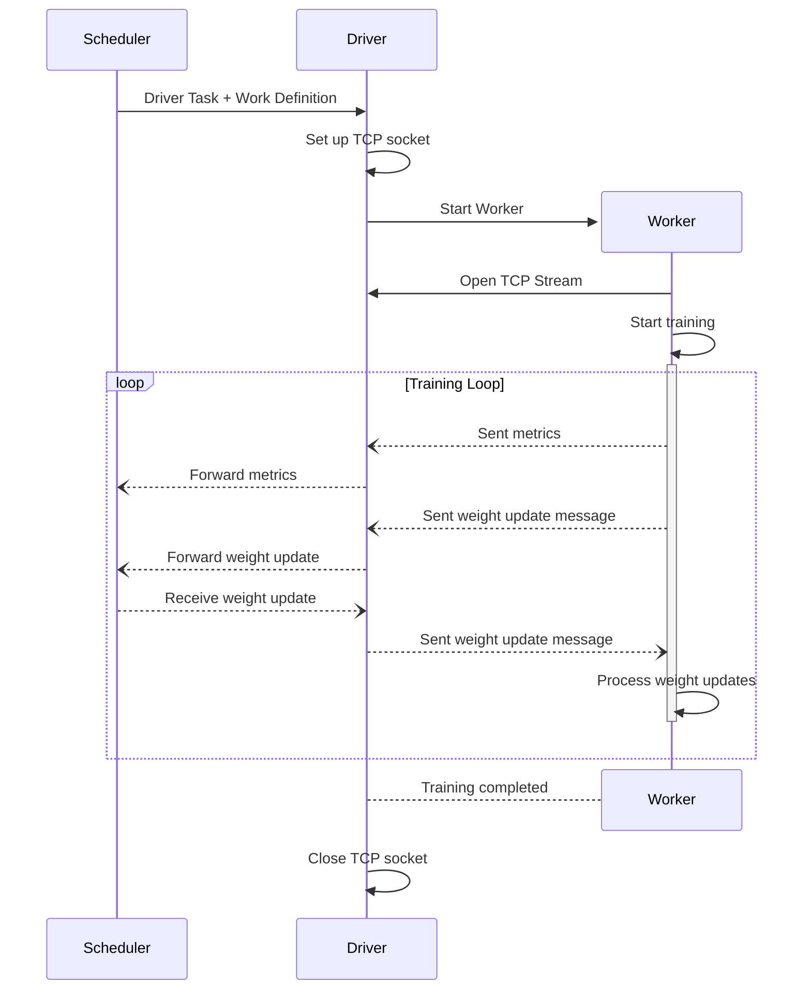

# 2025-04-30 Driver Worker Communication

## Overview

This RFC suggests a communication mechanism between the Driver and the Worker on a compute node. The communication channel will be used to forward information, like training metrics and gradient updates, from the Worker to the DiLoCo server.

## Background

When a Driver stars a Worker process, the two processes need to have a communication channel to exchange information. The information can be metrics from the training process, like the current Loss value or Perplexity/Accuracy, or notifications to the Driver that it should forward gradient updates to the DiLoCo server. The communication needs to be bidirectional because the Worker needs to be notified when updated model weights arrive.

## Proposal

This RFC proposes a TCP-based approach to handle the communication between Driver and Worker. TCP provides enough flexibility to handle efficient communication between different processes, independent of their actual implementation. This means that the Worker can be a simple Python process, but it can also be a process started within a Docker container.

This RFC proposes to use Protobuf to define the messages and their content. Protobuf provides a flexible and streamlined way of exchanging structured data between various programming languages.

The process to initiate the communication will work like the following:



The Scheduler is included to highlight that the Driver relays messages between the Worker and other processes. This can be the Scheduler as above or a DiLoCo server.

### Message Definition

The two message types exchanged between Driver and Worker will look the following:

```protobuf
message MetricSet {
  map<string, double> items = 1;
  int64 data_processed = 2;
  int32 local_round = 3;
}

message WeightUpdate {
  string model_path = 1;
}
```

The `MetricSet` is a collection of all metrics that have been collected during a local training round. To average the metrics across all Worker, the message includes how many data points have been processed.

The `WeightUpdate` message only contains a path to the file that contains the parameters. The data is exchanged via the file system for multiple reasons. The Worker will always write the intermediate results (checkpoints) to the file systems for recoverability. The parameter files are potentially larger than the Workers or Drivers RAM. Thus, if the data should be streamed across the communication channel, they will be first read by the Workers and streamed to the Driver, who will need to store it on disk before it will be forwarded. To reduce the reading and writing to the file system, only the path to the specific file is exchanged.

## Abandoned Ideas

The first iteration of the communication process between Driver and Worker was based on an exchange folder, where both processes write their respective messages as files. This idea was quickly abandoned because it is only a good fit for exchanging large messages like gradients. However, exchanging metrics and other messages is more complex. Furthermore, implementing a file watcher that tracks changes on the exchange folder is almost the same work as implementing the socket-based approach proposed above. 