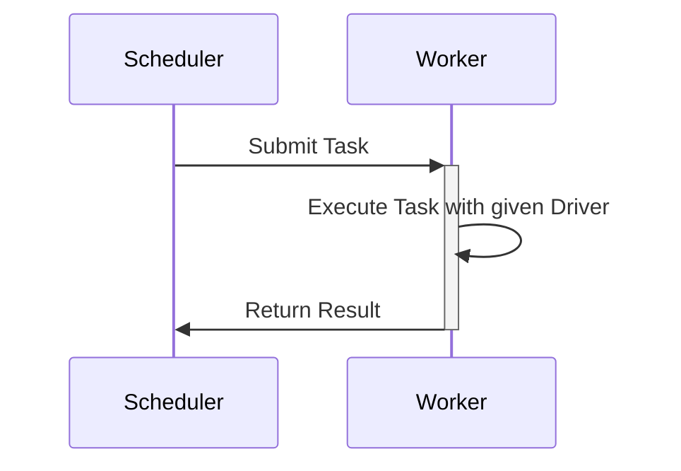

# Torch(Distributed) Driver Definition

## Overview

Once a communication channel is established and a scheduler has identified a potential worker,
it needs to send tasks to distribute the workload between the workers. This RFC describes
what needs to be communicated between worker and scheduler to train a (large) model
with Torch(Distributed). The following will also dissect the upstream communication
from workers to the scheduler or a parameter server that runs DiLoCo.

## Background

When a worker is connected to the Hypha-Network, we will need a mechanism to distribute work to it that has
been submitted to a Scheduler. In the following, we focus on a task description for Supervised Deep Learning
workloads, with TorchDistributed as the computational backend. Additionally, we will describe what the worker will
return upon task completion.



The above sequence diagram depicts the overall setup. The scheduler distributes work to the Worker, which will
perform the work with a specific driver and finally return a result.


## Proposal

To submit a Task to the Worker, the Scheduler needs to provide the following information:

 * What type of Task should be performed.
 * What model should be trained.
 * Which data should be used.
 * What to do during the training.

 The first information is required to identify the driver for the workload. In this case, it is `TorchDistributed`. Next, the worker will need
 to get a model definition. In the first iteration, it will be enough to simply provide a link to a storage location (S3, Hugging Face Hub)
 where the model can be downloaded from. If the model isn't hosted on Hugging Face Hub, it needs to be saved with either
 [`save_pretrained`](https://huggingface.co/docs/transformers/en/main_classes/model#transformers.PreTrainedModel.save_pretrained) or
 [`torch.save`](https://pytorch.org/docs/stable/generated/torch.save.html#torch.save) and the weights converted to
 [safetensors](https://huggingface.co/docs/safetensors/en/index). The data is shared similarly. The worker will
 need a link to a location where the data can be obtained from, and identifiers for the data that it should process.

 Finally, the Worker will also need a description of the specific task that needs to be performed with the data. This includes which
 loss function, optimizer and learning rate scheduler it should use and how many local steps it should perform.

### Job Definition

 The definition of a workload will then look like this:
 ```JSON
 {
  job_id : <JOB_ID>,
  driver: "torch_distributed",
  model: <MODEL_PATH>,
  data: { location : <DATA_PATH>, chunk : [<IDENTIFIER>, ...]}
  training_definition : {
    loss_fn: <LOSS_FN>,
    local_steps: <LOCAL_DILOCO_ROUNDS>,
    optimizer: <OPTIMIZER>,
    lr_scheduler: <SCHEDULER>,
    accelerate_config: ...,
    ...
  }
 }
 ```

The definition is in JSON for the sake of simplicity and to represent its structure.

With knowing what the Scheduler communicates to the Worker. We will now move on to the actual driver.

### Driver Definition

The Worker will need to download the model and the data before it can start with the actual training process. While the model
needs to be fully downloaded before the training can start; the data can be requested from the storage as the training progresses. For the sake of
simplicity, the Worker will simply download its assigned chunk of data. In a later stage, this process can be more advanced where the Worker's data
loader requests data while the training proceeds. This will provide more flexibility because the Scheduler doesn't need to assign a fixed number
of data points that should be processed, but the Worker requests new data at its own pace. However, this will make the accounting of which portion of data has already been processed more complicated. Thus, this can be introduced at a later stage.

The above logic to download models and data should be part of the Driver logic. Since we want the driver to use TorchDistributed and with it
all available hardware. Configuring TorchDistributed is complicated. To abstract the specific configuration details away, we will use [Accelerate](https://huggingface.co/docs/accelerate/index) as the
entry point for the driver. It will outsource the configuration into a file and allows us to use a simple training script that generalizes to different ttraining settings.
Initially the driver will start the training with:

```
accelerate --config-file config.yaml torch_training.py --loss_fn ...
```

Where the `torch_training.py` script implements the training logic. It will look like the following:

```Python
def main(args):
    # Initialize Accelerate
    accelerator = Accelerator()
    device = accelerator.device

    # Load the model and data and prepare the training
    model = load_model(args.model_path)
    data_set = DistributedDataset(args.data)
    dataloader = torch.utils.data.data_set(data_set, batch_size=args.batch_size)
    optimizer = get_optimizer(args.optimizer)
    scheduler = get_scheduler(args.lr_scheduler)
    loss_fn = get_loss_fn(args.loss_fn)

    # Add Accelerate hooks
    model, optimizer, dataloader, scheduler = accelerator.prepare(
        model, optimizer, dataloader, scheduler
    )

    # Training Loop
    for batch in training_dataloader:
        optimizer.zero_grad()
        inputs, targets = batch
        outputs = model(inputs)
        loss = loss_function(outputs, targets)
        accelerator.backward(loss)
        optimizer.step()
        scheduler.step()

    # Save a model checkpoint to disk
    checkpoint(model)

if __name__ == "__main__":
    # Parse the arguments
    args = parser.parse_args()
    main(args)

```

The above provides a pseudocode representation of the training logic. What is currently missing
is a detailed description of how the trained model is returned to the DiLoCo parameter server.
In an ideal scenario we can wrap that around the training loop, which would allow for
streaming DiLoCo. However, the idea needs to be refined, and for now it is sufficient that
the result will be a model checkpoint on disk that can be forwarded to the DiLoCo server.

When we have multiple Worker in a Device Group, they should have a shared drive with enough memory to
store the model and multiple checkpoints. The shared drive allows us to only download the model once,
and all Workers can load it from the shared drive. Furthermore, the drive will be used for saving
checkpoints, which are essential for robustness and to communicate intermediate weights to the
DiLoCo server. 
