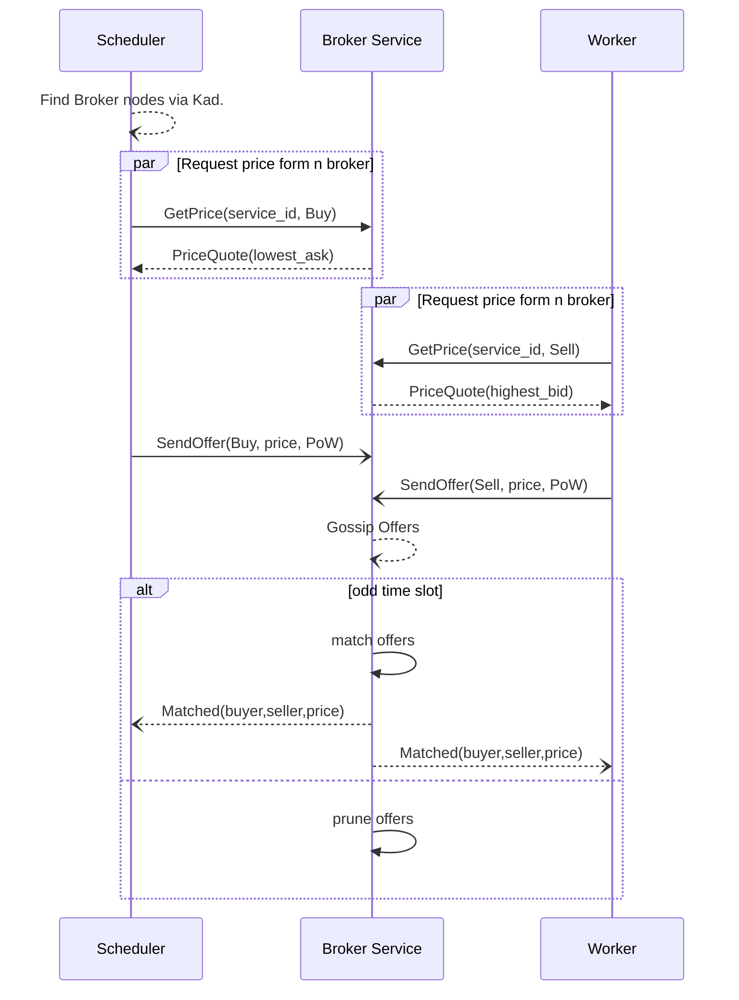

# Market-Based Resource Allocation

## Overview

This RFC proposes the design and integration of a decentralized auction-based marketplace, based on PeerMart [^5] design, into the Hypha. The goal is to enable efficient, peer-to-peer trading of bundled compute resources (GPU, CPU, RAM, Disk, etc.) required for workloads. This RFC addresses the challenge of dynamic resource allocation and incentivization in a heterogeneous, decentral environment.

The design aims to achieve:

- Economic efficiency: Allocations converge toward Pareto optimal outcomes, where no peer can be made better off without making another worse off.
- Strategic stability: Auctions approach Nash equilibria, meaning no peer can improve its own outcome by unilaterally changing its bidding strategy.

## Background

Hypha aims to orchestrate ML workloads across diverse, decentral hardware. A key challenge in such systems is the efficient allocation of resources. Currently, Hypha has no generalized mechanism for `Workers` to offer their compute capabilities and for `Schedulers` to procure these resources dynamically.

General market-oriented resource management has been extensively studied [^1] and found to effectively solve these challenges. Examples include resource allocation in distributed systems like fog/edge computing [^3] [^4], decentralized auction systems for multi-agent task allocation [^2], and earlier P2P market systems like Tycoon [^6].

From the set of reviewed market-based approaches, PeerMart [^5] offers a robust yet simple blueprint for a decentral auction-based market. It implements a simple economic efficient **double auction**, where both buyers and sellers submit bids and asks for well defined _services_, and a clearing price is determined.
While other approach like combinatorial auctions would provide a more  powerful mechanism for expressing complex preferences (e.g., "I want GPU X and CPU Y, but only if I get both from the same provider"), they are significantly more complex to implement and solve in a decentralized P2P setting compared to multiple double auctions for pre-defined resource bundles (_services_).

## Proposal

This RFC proposes adapting PeerMart [^5] to Hypha, allowing `Schedulers` to bid for standardized compute bundles (Hypha Compute Profiles) and `Workers` to offer these bundles. This will benefit:

- **Schedulers**: By providing a transparent mechanism to find and acquire necessary compute resources at competitive, market-driven _prices_.
- **Workers**: By enabling them to offer (_monetize_) their idle or available compute resources effectively.
- **Scalability**: By enabling automatic resource scaling based on demand (_prices_).

NOTE: Hypha doesn't implement any means for monetizing resources.

Hypha doesn't implement any means for monetizing resources and this RFC doesn't intend to change that. We may consider implementing a resource monetization mechanism in the future though. The market approach is initially simply a means to allocate resources efficiently, ensuring that resources are used optimally and fairly among participants. Prices in this context function as virtual tokens or credits rather than actual currency.

Along with monetization, we would need to introduce a mechanism to handle market failures or disputes.

* PeerMart facilitates the match [^5]. The actual service delivery and payment are subsequent steps.
* Hypha will need mechanisms (potentially outside of PeerMart's direct scope) for:
* Confirming service delivery.
* Handling disputes if a Worker fails to provide the agreed-upon bundle after a match, or a Scheduler fails to pay (if a payment mechanism is integrated).
* Reputation systems can play a role here, penalizing non-compliant actors, as suggested as an extension in the PeerMart paper [^5].

### Flow

The market-based resource allocation system follows a structured interaction pattern that enables decentralized price discovery and resource matching. This flow outlines how Schedulers, Workers, and Broker services interact to create an efficient marketplace for compute resources.

Initially, both `Schedulers` (buyers) and `Workers` (sellers) need to discover the appropriate brokers for their desired compute profile. Using Kademlia's distributed hash table, they locate the broker nodes responsible for the specific profile_id they wish to trade. This discovery process ensures that market participants can find each other without relying on centralized coordination.

Before submitting binding offers, participants typically query current market conditions. Schedulers request price information from multiple brokers to discover the lowest available asking price for their desired profile, while Workers inquire about the highest current bid. These non-binding price quotes provide market transparency and help participants formulate competitive offers.
With market information in hand, participants submit their binding offers. Schedulers send buy offers indicating their maximum willingness to pay for a profile, and Workers submit sell offers stating their minimum acceptable price. Each offer includes a proof-of-work (PoW) solution that prevents spam attacks and demonstrates commitment. These offers are received by brokers and then propagated to other relevant brokers through a gossip protocol, ensuring consistent market information across the broker network.
The marketplace operates on a synchronized time slot system. During odd-numbered time slots, brokers execute their matching algorithm, pairing compatible buy and sell offers based on price compatibility. When a match occurs, both the Scheduler and Worker are notified of the successful pairing and provided with the agreed transaction price (calculated as the average of the bid and ask prices). During even-numbered time slots, brokers perform maintenance operations such as pruning expired offers to keep the order book current.

This systematic flow creates a dynamic marketplace where compute resources are efficiently allocated based on supply, demand, and price signals, all without requiring centralized coordination.

After successful matching, the `Scheduler` and `Worker` establish a direct connection to fulfill the computational workload according to the agreed terms. This separation of market clearing from service delivery keeps the broker's responsibilities focused and manageable while allowing peer-to-peer service execution.

### Core Concepts

#### Market Participants

The marketplace is designed around three key types of participants, each playing a crucial role in the resource allocation ecosystem. These participants interact within a peer-to-peer framework to create an efficient market for compute resources:

- **Schedulers (Buyers)** represent the demand side of the market, acting on behalf of ML workloads that require specific compute resources. They submit bids expressing both their resource requirements (through the profile_id) and their willingness to pay (through bid prices).
- **Workers (Sellers)** form the supply side, offering their available compute resources to the network. These nodes indicate their capabilities through standardized profiles and their desired compensation through ask prices.
- **Brokers** facilitate the market by maintaining order books and matching compatible bids and asks. Rather than existing as separate node types, the broker role is a functionality that can be performed by other nodes (such as `Gateways` or `Workers`) based on their position in the Kademlia DHT relative to specific `profile_ids`. This distributed approach ensures that no single point of failure exists in the marketplace.

#### Hypha Compute Profiles (HCP)

Traded resource bundles are based on pre-defined HCPs of compute resources (GPU, CPU, RAM, Disk, Network) with a standard _price/time unit_ (e.g., per minute).
Each unique HCP configuration will have a unique `profile_id`, generated by hashing its canonical `ProfileAttributes`.
For propsal of inital HCPs see Appendix A.
Introducing a well definde set  of profiles is key to enable large enough markets without incuring the complexities of combinatorial auctions.
A worker must meet the profile minimum but may offer more then specified. A worker will select the _largest_ matching profile for its resources.
We may introduce accelerator specific profiles as they may have different value to users and come with different _pricing_ criteria.

* The initial set of HCP (Appendix A) will be crucial. This list will need to be maintained and updated by the Hypha community or a governance process as hardware evolves and new workload patterns emerge.
* A clear process for proposing and adopting new HCPs will be necessary to balance standardization (for liquidity) with evolving needs. This includes publishing the exact `ProfileAttributes` for each HCP.

#### Double Auction

The core of our market design is a decentralized double auction system inspired by PeerMart [^5], where both sides of the market actively participate in price formation. In this system, Workers submit asks (sell offers) specifying the minimum price they're willing to accept for their compute resources, while Schedulers submit bids indicating the maximum price they're willing to pay. Each offer is associated with a specific HCP identified by its `profile_id`.
When a broker receives offers, it maintains an order book that ranks bids in descending price order (highest willingness to pay first) and asks in ascending price order (lowest required compensation first). The broker keeps the best `m/2` offers for each side to manage memory utilization while preserving the most valuable market information.
Matching occurs automatically when the highest bid price equals or exceeds the lowest ask price for the same profile. The transaction price is set as the mean of the matched bid and ask prices, striking a fair balance between buyer and seller preferences. This pricing mechanism helps ensure that neither party can manipulate the market to their exclusive advantage.
All offers are timestamped and come with a TTL, enabling the system to expire stale offers and potentially prioritize older offers within the same price tier.

NOTE: The initial versiin will not protect the market from spam and denial-of-service attacks. Future iteration should include a proof-of-work (PoW) challenge solution or proof of stake with each offer.

#### Finding Brokers

The decentralized nature of Hypha requires a robust mechanism for discovering brokers that maintain order books for specific HCPs. Our approach leverages the Kademlia distributed hash table (DHT) to efficiently map compute profiles to responsible brokers.
Each unique `profile_id` (derived from hashing the `ProfileAttributes` of a compute profile) serves as a key in the Kademlia DHT. Nodes willing to provide broker services advertise their availability by calling `providing("broker")` via the Kademlia implementation. This creates a distributed registry of potential brokers across the network.
For resilience and load distribution, multiple brokers handle each profile market.
The specific brokers responsible for a profile are determined by their proximity in the DHT keyspace—the `n` peers whose `PeerIds` are numerically closest to the `profile_id` become the designated _broker_ for that market.

With `n` dynamically calculated as `n = min(5, sqrt(total_active_nodes))`. This formula ensures a minimum of 5 brokers for small networks—providing redundancy and byzantine fault tolerance—while scaling sublinearly with network growth to prevent excessive overhead in large deployments.

This approach ensures that broker responsibility is distributed deterministically across the network, preventing centralization while enabling any node to reliably locate the appropriate brokers for a given profile.

## Abandoned Ideas (Optional)

* **Centralized Markets**: Contradicts Hypha's decentralized design and introduces a single point of failure - the same applies for other centralized resource management mechanisms.
* **Combinatorial Auctions for Bundles**: While powerful for expressing complex preferences (e.g., "I want GPU X and CPU Y, but only if I get both from the same provider"), combinatorial auctions are significantly more complex to implement and solve in a decentralized P2P setting compared to multiple double auctions for pre-defined bundles. Starting with simpler bundled items is more feasible.
* **Direct Price Negotiation without Brokers**: Less efficient for price discovery in a large market; can lead to higher transaction costs and information asymmetry. The broker-based double auction aims for better market efficiency [^5].
* **Full broadcast of all offers to all peers**: Discarded due to O(N²) messaging.

## Scalability and Performance Considerations

* The number of distinct `profile_id`s (HCPs) directly impacts the number of gossipsub topics and Kademlia lookups. The initial set of HSPs should be modest to ensure performance.
* Broker load depends on the transaction volume for the HCPs they manage. The `m/2` limit on stored bids/asks per broker helps manage state [^5].
* Performance of the underlying libp2p Kademlia, Gossipsub, and Request-Response implementations is critical.

## Appendix A: Initial Hypha Compute Profile (HCP) Definitions (Draft)

Initial set based on analysis of GPU instance configurations across cloud vendors . The time/price unit is `Minute` for all profiles.

| Name            	| GPU Type (Model & VRAM/GPU)                                                                                	| GPU Quantity 	| Total GPU VRAM (per node/instance) 	| GPU Interconnect              	| CPU Type (General Class)         	| CPU Cores (Range) 	| System Memory (Range) 	| Disk Type (General Class)  	| Disk Capacity (Range) 	|
|-----------------	|------------------------------------------------------------------------------------------------------------	|--------------	|------------------------------------	|-------------------------------	|----------------------------------	|-------------------	|-----------------------	|----------------------------	|-----------------------	|
| Discovery Alpha 	| NVIDIA T4 (16GB/GPU), AMD Radeon Pro V520 (8GB/GPU), NVIDIA P4 (8GB/GPU)                                   	| 1-2          	| 8GB-16GB                           	| PCIe                          	| x86_64 (Standard Perf)           	| 4-8               	| 16GB-64GB             	| SSD / NVMe SSD             	| 100GB-1TB             	|
| Discovery Beta  	| NVIDIA A10G (24GB/GPU), NVIDIA L4 (24GB/GPU), AMD MI25 (16GB/GPU, if fractional for ~24GB total)           	| 1-2          	| 16GB-24GB                          	| PCIe                          	| x86_64 (Standard Perf)           	| 4-16              	| 32GB-128GB            	| NVMe SSD                   	| 200GB-1TB             	|
| Impulse Alpha   	| NVIDIA V100 (16GB/GPU or 32GB/GPU), NVIDIA Tesla M60 (16GB/GPU, older)                                     	| 1-2          	| 32GB                               	| PCIe / NVLink (for multi-GPU) 	| x86_64 (Standard to Mid Perf)    	| 6-24              	| 64GB-224GB            	| NVMe SSD                   	| 500GB-2TB             	|
| Impulse Beta    	| NVIDIA A100 (40GB/GPU), NVIDIA L40S (48GB/GPU), NVIDIA RTX 6000 Ada (48GB/GPU), NVIDIA A10 (24GB/GPU)      	| 1-2          	| 40GB-48GB                          	| PCIe / NVLink (for multi-GPU) 	| x86_64 (Mid-High Perf)           	| 8-60              	| 90GB-480GB            	| NVMe SSD                   	| 500GB-3TB             	|
| Warp Alpha      	| NVIDIA V100 (16GB/GPU), NVIDIA V100S (32GB/GPU), NVIDIA T4 (16GB/GPU)                                      	| 2-4          	| 64GB                               	| NVLink                        	| x86_64 (Mid Perf)                	| 12-64             	| 128GB-448GB           	| NVMe SSD                   	| 1TB-4TB               	|
| Warp Beta       	| NVIDIA A100 (80GB/GPU), NVIDIA H100 (80GB/GPU), NVIDIA H100 NVL (94GB/GPU), NVIDIA GH200 (96GB/GPU shared) 	| 1            	| 80GB-96GB                          	| PCIe / SXM / NVLink-C2C       	| x86_64 or Arm (High Perf)        	| 12-96             	| 90GB-640GB            	| NVMe SSD (High IOPS)       	| 1TB-8TB               	|
| Warp Gamma      	| NVIDIA V100 (16GB/GPU), NVIDIA A100 (80GB/GPU), NVIDIA L40S (48GB/GPU), NVIDIA H100 (80GB/GPU)             	| 2-8          	| 128GB-192GB                        	| NVLink / NVSwitch             	| x86_64 (High Perf)               	| 30-128            	| 300GB-1520GB          	| NVMe SSD (High IOPS)       	| 2TB-10TB              	|
| Warp Delta      	| NVIDIA A100 (40GB/GPU or 80GB/GPU), NVIDIA H100 (80GB/GPU)                                                 	| 4-8          	| 320GB-384GB                        	| NVSwitch / InfiniBand / EFA   	| x86_64 (High Perf)               	| 60-208            	| 720GB-1872GB          	| NVMe SSD (High IOPS)       	| 4TB-30TB              	|
| Warp Epsilon    	| NVIDIA A100 (80GB/GPU), NVIDIA H100 (80GB/GPU)                                                             	| 8            	| 640GB                              	| NVSwitch / InfiniBand / EFA   	| x86_64 or Arm (High Perf)        	| 96-240            	| 1TB-2TB               	| NVMe SSD (High IOPS)       	| 8TB-60TB              	|
| Jump Alpha      	| NVIDIA H200 (141GB/GPU), NVIDIA B200 (180GB/GPU), AMD MI300X (192GB/GPU)                                   	| 8            	| 1128GB - 1536GB+ (for 8 GPUs)      	| Latest NVSwitch / InfiniBand  	| x86_64 or Arm (Latest High Perf) 	| 112-224+          	| 2TB-4TB+              	| NVMe SSD (Ultra High IOPS) 	| 30TB-60TB+            	|

## References

[^1]: S. K. Garg and R. Buyya, “Market‐Oriented Resource Management and Scheduling: A Taxonomy and Survey,” in Cooperative Networking, 1st ed., M. S. Obaidat and S. Misra, Eds., Wiley, 2011, pp. 277–305. doi: 10.1002/9781119973584.ch14.
[^2]: M. Braquet and E. Bakolas, “Greedy Decentralized Auction-based Task Allocation for Multi-Agent Systems,” Jun. 30, 2021, arXiv: arXiv:2107.00144. doi: 10.48550/arXiv.2107.00144.
[^3]: D. T. Nguyen, L. B. Le, and V. Bhargava, “A Market-Based Framework for Multi-Resource Allocation in Fog Computing,” Apr. 16, 2019, arXiv: arXiv:1807.09756. doi: 10.48550/arXiv.1807.09756.
[^4]: D. T. Nguyen, L. B. Le, and V. Bhargava, “Price-based Resource Allocation for Edge Computing: A Market Equilibrium Approach,” May 08, 2018, arXiv: arXiv:1805.02982. doi: 10.48550/arXiv.1805.02982.
[^5]: D. Hausheer and B. Stiller, “PeerMart: the technology for a distributed auction-based market for peer-to-peer services,” in IEEE International Conference on Communications, 2005. ICC 2005. 2005, Seoul, Korea: IEEE, 2005, pp. 1583–1587. doi: 10.1109/ICC.2005.1494610.
[^6]: K. Lai, L. Rasmusson, E. Adar, S. Sorkin, L. Zhang, and B. A. Huberman, “Tycoon: an Implementation of a Distributed, Market-based Resource Allocation System,” Dec. 09, 2004, arXiv: arXiv:cs/0412038. doi: 10.48550/arXiv.cs/0412038.
