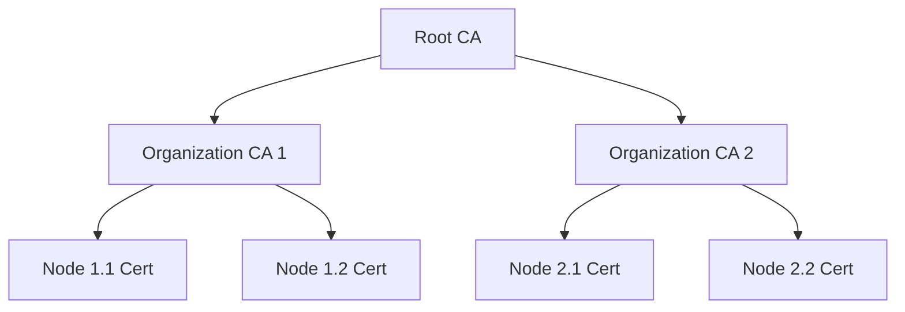

# mTLS support for secure permissioned p2p networks

## Overview

This RFC proposes adding mutual TLS (mTLS) support as an alternative to the current self-signed certificate approach. This enhancement enables libp2p based nodes to leverage traditional Public Key Infrastructure (PKI) with Certificate Authority (CA) based authentication, making it suitable for permissioned peer-to-peer networks where trust is rooted in organizational CAs rather than self-generated identities.

**Important:** This will limit transport to TCP only for the time being. Initially, we'll only support Ed25519 keys.

The primary goal is to enable enterprises and organizations to run libp2p-based networks that comply with their existing security policies and infrastructure.

## Background

The libp2p TLS 1.3 specification[^1] defines how TLS is used in libp2p networks. The key aspects are:

1. **Self-signed certificates**: Each peer generates its own certificate
2. **Custom X.509 extension**: Contains the peer's public key in a libp2p-specific extension (OID 1.3.6.1.4.1.53594.1.1)
3. **Stable PeerIDs**: The PeerID is derived from the peer's long-term identity key, not the TLS certificate
4. **No PKI requirement**: Trust is established through the libp2p protocol, not certificate chains

While this approach works well for open, permissionless networks, it presents significant challenges for enterprise needing permissioned deployments that PNET[^4] does not properly address:

- **Regulatory Compliance**: Many organizations require all TLS certificates to be issued by trusted CAs for audit and compliance reasons
- **PKI Integration**: Enterprises have existing PKI and certificate lifecycle management that cannot accommodate self-signed certificates
- **Identity Management**: Organizations need centralized control over node identities and the ability to revoke access
- **Security Policies**: Corporate security policies often prohibit self-signed certificates in production environments

## Proposal

This proposal introduces an alternative TLS configuration mode that deviates from the libp2p TLS specification by using standard mTLS with CA-signed certificates. Instead of self-signed certificates with custom extensions, we use traditional PKI.

Most notably, we completely omit the libp2p public key extension (OID 1.3.6.1.4.1.53594.1.1) that typically carries the peer's identity key in libp2p networks. Instead of using self-signed certificates as specified in the libp2p standard, our implementation requires all certificates to be signed by a trusted CA, bringing the system in line with traditional PKI practices.

The identity model also differs significantly from standard libp2p. Rather than maintaining separate, stable identity keys that persist across certificate rotations, PeerIDs in our system are derived directly from the certificate's public key. This means that when a certificate is renewed or rotated, the node's PeerID changes accordingly—a trade-off we accept in exchange for
simplified key management and stronger alignment with enterprise PKI systems.

Perhaps most importantly, the trust model shifts from protocol-level verification to certificate-based authentication. While standard libp2p establishes _trust_ through its custom handshake protocol that verifies the identity key, our approach relies on the certificate chain validation performed by the TLS layer. This allows us to leverage battle-tested PKI infrastructure and tools while providing cryptographically verifiable proof of organizational membership and key ownership.

### Implementation

Building on the original libp2p TLS and QUIC transports the implementation leverages the `rustls`[^2] library, specifically its battle-tested WebPkiClientVerifier[^3] for certificate validation, ensuring robust and standards-compliant certificate chain verification.

libp2p was forked and patched to support certificate-based authentication across its transport crates.

**Critical Limitations:**

- **Ed25519 Only**: All certificates must use Ed25519 keys for the time being.
 We may add support for RSA and ECDSA using the `secp256r1` curve but will never support `secp256k1` from the set of libp2p identity key algorithms for compatibility with Web PKI.

Private keys must be provided in PKCS#8 format for proper parsing and usage.

### Security Considerations

This proposal incorporates several security measures specifically designed for enterprise peer-to-peer environments. These considerations address both the unique requirements of P2P networking and the compliance needs of organizational deployments.

Mutual authentication forms the cornerstone of our security model, where both client and server nodes authenticate each other using their respective certificates. This bidirectional verification ensures that every connection establishes trust in both directions, preventing unauthorized nodes from joining the network. Unlike traditional client-server architectures where only the server presents credentials, this approach recognizes that in P2P networks, every participant must be equally trustworthy.

Building on this foundation of mutual trust, the implementation follows libp2p conventions by disabling Server Name Indication (SNI) during the TLS handshake. This design choice, inherited from the original libp2p TLS specification[^1], serves multiple purposes; it maintains compatibility with existing libp2p extensibility requirements and simplifies our initial implementation. While SNI could theoretically be enabled in future versions along with support for dynamic certificate signing needed for nodes with changing IP addresses, the current approach prioritizes simplicity and compatibility.

Complementing the authentication mechanisms, Certificate Revocation Lists (CRLs) provide immediate access control capabilities that are essential for enterprise security policies. Network administrators can revoke compromised or unauthorized certificates without waiting for natural expiration, enabling rapid response to security incidents and ensuring that revoked nodes cannot establish new connections. In the initial implementation, CRLs are only loaded from disk during node initialization assuming that nodes don't run indefenitly, future versions should support dynamic refresh capabilities.

Finally, the cryptographic foundation relies exclusively on Ed25519 keys, maintaining compatibility with the libp2p identity system while leveraging the security properties of modern elliptic curve signature schemes.
This choice balances cryptographic strength with the performance considerations essential for P2P networking, while ensuring compatibility with existing libp2p tooling and infrastructure. Future versions will add support for RSA and ECDSA using the `secp256r1` curve but neither support other libp2p curves nor other algorithms from the Web PKI specs to maintain compatibility between the two systems.

### Design Decisions

The design of this mTLS implementation represents a deliberate shift toward enterprise-grade infrastructure at the cost of some traditional libp2p characteristics. We accept that `PeerID`s will change when certificates rotate, typically on an annual basis, trading the stability of long-term identities for simplified key management aligned with standard PKI practices. This shouldn't be an issue given the intended use-case of Hypha.

This implementation also creates a clear separation from the broader libp2p ecosystem, as mTLS-enabled nodes cannot communicate with standard libp2p nodes using self-signed certificates.

The requirement for comprehensive certificate management introduces operational overhead that organizations must consider. Teams need to establish PKI infrastructure, implement certificate distribution mechanisms, and plan for regular rotation cycles. Additionally, our initial focus on TCP transport means that QUIC connections are not supported, potentially limiting performance optimizations available in modern libp2p deployments.

However, these trade-offs enable significant benefits for enterprise environments. The implementation satisfies regulatory and audit requirements that mandate certificate-based authentication, while providing centralized control through Certificate Authorities. Organizations can leverage their existing PKI tooling and expertise, reducing the learning curve and integration complexity. Most importantly, certificates provide cryptographically verifiable proof of organizational membership, establishing clear trust boundaries that align with business requirements.

Our design rationale explicitly targets permissioned networks where organizational control is paramount. In these environments, all participating nodes operate under centralized authority, certificates serve as the definitive source of identity, and `PeerID` changes can be managed through existing configuration management systems. This approach works best when network boundaries naturally align with organizational boundaries, making the certificate-based trust model a natural fit for the operational context.

## Abandoned Ideas

### 1. Separate Identity and Transport Keys

**Idea**: Use CA certificates for transport only, maintain separate libp2p identity keys included via libp2p extension in CA-signed certificates to maintain stable PeerIDs.

**Why Abandoned**:
- Requires custom CA configuration to preserve extensions and thus defeats the purpose of using standard PKI
- Increases complexity with two key management systems
- Unclear security model with mixed trust anchors
- Goes against the principle of certificates as single source of truth

### 2. Bridge Nodes

**Idea**: Special nodes that can speak both mTLS and standard libp2p protocols.

**Why Abandoned**:
- Security risks from protocol downgrade attacks
- Complexity of maintaining two trust models
- Unclear use cases in permissioned environments

## Migration and Deployment

### Prerequisites
- Establish PKI infrastructure with Root (and Intermediate) CAs
- Define certificate issuance policies and procedures
- Set up certificate distribution mechanism
- Plan for certificate rotation and `PeerID` changes

### Deployment Steps
1. Generate CA hierarchy using existing PKI (use provided certificate utility for testing and development)
2. Issue certificates for all nodes
3. Configure nodes with certificate files and CA trust store
4. Optionally set up CRL distribution for revocation
5. Monitor certificate expiration and plan rotation

### Operational Considerations
- Certificate renewal should happen before expiration
- Peer discovery mechanisms must handle `PeerID` changes
- Monitoring should track certificate validity and expiration
- Consider shorter certificate lifetimes for higher security
- CRL updates require node restarts

## Future Work

1. **Dynamic CRL Refresh**: Support CRL updates without node restart
4. **Hardware Security Modules**: Integration with HSMs for key protection
5. **Automatic Rotation**: Built-in certificate renewal without service restart
6. **Multi-CA Federation**: Support for multiple trusted CAs in federated networks
7. **Performance Optimization**: Caching and session resumption for mTLS handshakes

## References

[^1]: [libp2p TLS 1.3 Specification](https://github.com/libp2p/specs/blob/master/tls/tls.md)
[^2]: [rustls](https://docs.rs/rustls/0.23.27/rustls/index.html)
[^3]: [rustls WebPkiClientVerifier](https://docs.rs/rustls/latest/rustls/server/struct.WebPkiClientVerifier.html)
[^4]: [libp2p PNET](https://github.com/libp2p/rust-libp2p/tree/master/transports/pnet)
