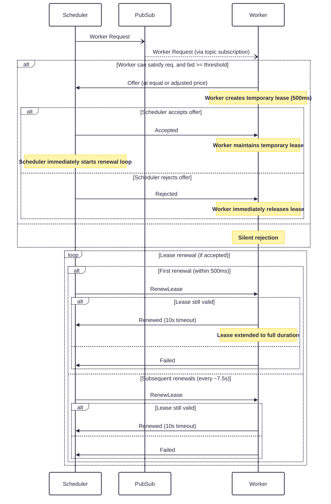
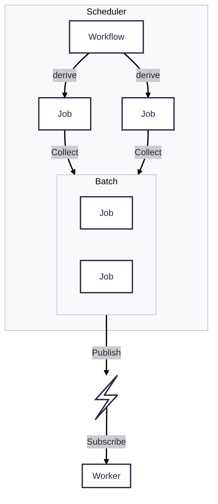

# Decentralized Resource Allocation Protocol

## Overview


This RFC proposes a Decentralized Resource Allocation Protocol (dRAP). It enables fully decentralized discovery and efficient matching between schedulers and workers via a publish/subscribe overlay network. Instead of having schedulers query workers, schedulers publish “task advertisements” (task-ads), and workers respond if they can run the task. Workers can counter the offered price while schedulers pick the best price from the set of responding workers providing a fast bounded negotiation with the _prices_ used to balancing load across workers as well as a signal to add more resource to the network. The main goals are:

* Fully decentralized discovery and matching via pub-sub overlay (Gossipsub)
* Per-worker micro-auctions through a single round of counter-offers to negotiate an appropriate virtual price for the requested resource bundle.
* Support for heterogeneous, multi-resource tasks (e.g., GPU, CPU, RAM, disk) with fractional sharing (MIG/time-slices) and preemption.
* Fast convergence (placement within ≲1 second) and high utilization without central coordination
* Scalable support for complex ML workloads spanning multiple workers

## Background

Large‑model workloads easily exceed a single GPU’s memory. Existing solutions fall into two buckets:

* **Central clusters** (Kubernetes, Ray, Slurm) – high CAPEX/OPEX, single point of failure
* **Ad‑hoc P2P systems** (SWARM, Petals) – Lack's abbillity to dynamically form _swarms_ across connected peers.

We need a **unified, minimal protocol** that:

* Maintains a _tiny_ protocol overhead (one publish, one bid, one confirm message)
* Allows one job to span **many peers** and **change topology**
* Survives churn, slow links, and partial Byzantine behaviour

Both SWARM and Petals are built on libp2p via hivemind and provide functionality aligned with Hypha's goals but lack **mechanisms** to form _swarms_ across connected peers. While many of the existing decentralized scheduling and resource allocation mechanisms do not have the right properties (i.e. slow convergence) for the heterogeneous environments and workloads.

Per-worker market-based allocation (Tycoon, Eger & Killat’s P2P pricing) propose that each node runs a small auction for its own resources. This yields high utilization and fairness, but comes with a rather high communication overhead due to the many action rounds. Randomized sampling schedulers (i.e. Sparrow) allow schedulers to sample and probe a few random workers, but they lack multi-resource expressiveness and incentive signals. Combinatorial auctions enable scheduling complex bundles of resources but usually rely on a central auctioneer for winner determination, violating decentralization.

This RFC builds on the strengths of the different mechanisms and addresses the gaps by inverting the signaling pattern and limiting the auction rounds: Schedulers “push” task-ads (or batches of task-ads) to subscribed workers, and each worker locally decides whether to bid (counter-offer) or _reject_. This ensures:

* No central auctioneer: All matching happens via pub-sub and one round of RPC message exchange.
* Multi-resource matching: Task-ads carry full vectors of requirements; workers only respond if they can satisfy them.
* Dynamic pricing signals: Each worker maintains a local “price threshold” that adjusts automatically with utilization and task-ads signal willingness to pay based on their current needs and available resources.
* Fast, bounded negotiation: Exactly one worker -> scheduler counter-offer and one scheduler -> worker confirmation (max 4 messages).

## Proposal

The proposed Decentralized Resource Allocation Protocol is designed to be fast, bounded, and decentralized, suited for different workflows and job requirements.

This protocol serves as a foundation for building large-scale federated AI platforms where no single scheduler should hold global state, and any worker should autonomously decide when and how to execute tasks. The design enables everything from simple batch processing to complex distributed training scenarios while maintaining the decentralization and performance characteristics required for modern AI infrastructure.

### Message Flow




Schedulers _publish_ requests, describing resource and other requirements along with an initial bid (priority/virtual price). Workers _respond_ to these requests if they meet all requirements and their local price threshold. Workers may respond with a counter-offer if they can meet the requirements at a different price.

Workers create a temporary lease (500ms) when sending an offer to prevent offering the same resource to multiple schedulers simultaneously. The scheduler responds immediately with either `Accepted` or `Rejected`:
- **Accepted**: Worker maintains the temporary lease. The scheduler immediately starts its renewal loop, and must call `RenewLease` within 500ms to extend the lease to its full duration (10s). This prevents temporary leases from blocking resources unnecessarily.
- **Rejected**: Worker immediately releases the lease, freeing resources for other scheduling requests.

Once a lease is extended via the first renewal, the scheduler continues to renew the lease periodically (at ~75% of expiration) to maintain resource availability. With an active lease, a scheduler may dispatch jobs to workers which they'll execute.


#### Message Types

The protocol defines a set of clear request and response types to organize resource allocation and negotiation.

> [!TIP]
> Not specific to the proposed protocol, but it's worth noting that message pairs are organized into modules such that it is easier to tell what the correct response is to a request.

##### Scheduler requests available workers

The Scheduler broadcasts this message to find available workers matching requirements.

```rust
pub mod request_worker {

    use super::*;

    #[derive(Debug, Clone, Serialize, Deserialize)]
    pub struct Request {
        pub id: Uuid,
        pub spec: WorkerSpec,
        pub timeout: SystemTime,
        pub bid: f64,
    }
}
```

##### Worker offers

Workers offer a lease to scheduler if the request requirements are met. The scheduler responds with either `Accepted` or `Rejected`. An accepted offer creates a temporary lease (500ms) that the scheduler must extend via `RenewLease` within the timeout period.

```rust
pub mod worker_offer {

    use super::*;

    #[derive(Debug, Clone, Serialize, Deserialize)]
    pub struct Request {
        pub id: Uuid,
        pub request_id: Uuid,
        /// Worker's _counter-offer_ price
        pub price: f64,
        /// Resources reserved for this offer
        pub resources: Resources,
        /// Accept the offer within the timeout otherwise it's going to expire.
        pub timeout: SystemTime,
    }

    /// Scheduler responds with decision on the offer
    #[derive(Debug, Clone, Serialize, Deserialize)]
    pub enum Response {
        /// Scheduler accepts the offer - worker maintains temporary lease until first renewal
        Accepted,
        /// Scheduler rejects the offer - worker immediately releases the lease
        Rejected,
    }
}
```

#### Lease Renewal

Scheduler requests workers to extend the lease, which is necessary to maintain the worker's availability and ensure that the worker's resources are not wasted.

```rust
pub mod renew_lease {
    use super::*;

    #[derive(Debug, Clone, Serialize, Deserialize)]
    pub struct Request {
        pub id: Uuid,
    }

    /// Worker acknowledges the extension
    #[derive(Debug, Clone, Serialize, Deserialize)]
    pub enum Response {
        Renewed {
            id: Uuid,
            timeout: SystemTime,
        },
        Failed,
    }
}
```

### Worker Architecture

Workers implement three key components:

#### Arbiter Component

The Arbiter serves as the worker's market participation engine, subscribing to the `hypha/worker` gossipsub topic to monitor resource requests. It buffers incoming requests to enable fair evaluation of concurrent schedulers. The `RequestEvaluator` scores and ranks requests based on configurable strategies, with qualifying requests receiving short-lived lease offers. The Arbiter also coordinates lease renewals and job dispatch for accepted offers.

#### Lease Manager

The Lease Manager implements time-bounded resource reservations that bridge offer negotiation and job execution. Leases guarantee resource availability during the offer-acceptance window while automatically expiring unaccepted offers to prevent resource waste. For accepted offers, the system supports lease renewal for long-running jobs and ensures prompt resource release upon completion or failure.

#### Job Manager

Executes confirmed jobs with proper isolation:

### Scheduler Components

Schedulers implement resource allocation and job lifecycle management:

#### Allocator

The Allocator manages the scheduler's resource discovery process by broadcasting `RequestWorker` messages via gossipsub and collecting `WorkerOffer` responses. It employs a greedy selection strategy (lowest price first) to choose optimal offers and creates Worker handles to manage ongoing relationships with selected workers.

#### Worker Handle

The Worker Handle manages the active relationship between scheduler and allocated worker. It proactively renews leases at 75% of expiration time, dispatches jobs using the DispatchJob protocol, monitors execution status, and ensures graceful resource cleanup when the relationship ends.

### Request Batching and Windowing

Workers batch incoming requests within time windows to handle concurrent schedulers efficiently. This windowing approach ensures fair consideration of multiple competing requests, enables optimal resource packing across batches, and reduces message processing overhead compared to individual request handling.

### Pricing and Request Evaluation

Workers employ configurable evaluation strategies to select among competing requests. Profit maximization strategies prioritize highest bid prices, while utilization optimization favors requests that efficiently fill resource gaps. Affinity-based approaches can prefer certain scheduler types or workload characteristics, enabling workers to balance multiple objectives including profitability, efficiency, and strategic partnerships.

## Abandoned Ideas

- **Pure Pub-Sub Approach**: Initial designs used gossipsub for all communication. This was abandoned in favor of hybrid gossipsub + RPC for better reliability and lower latency in the offer/confirmation phase.
- **Complex Bin Packing**: Original ideas included sophisticated bin packing algorithms for optimal utilization. Simple greedy scoring seems sufficient and reduces complexity while maintaining good utilization.
- **Multi-Round Negotiation**: Earlier designs allowed price negotiation over multiple rounds. This was simplified to single-round offers to bound latency and complexity.

## Next Steps

The proposed dRAP protocol only convers the initial design and implementation. Future work will focus on improving fault tolerance, security, and performance.

### Automatic Rescheduling

Worker and Scheduler faults are already implicitly handled by the protocol as leases will fail to renew. In the event of a lease failure, we need to automatically rescheduled.

* **Lease Expiry**: Tasks without successful renewal are considered failed
* **Heartbeat Mechanism**: Optional periodic health checks for long-running jobs
* **Stream Failure**: Router components detect broken tensor streams and failover

### Worker Pool Management

The worker pool must be serialized and reconciled from disk to gracefully handle scheduler failovers. This ensures that the worker pool can be restored to a consistent state after a scheduler failure.

### Allocate multiple workers at once

The current implementation of dRAP sends one request per needed worker, but given uniform resource requirements, it can be optimized to send a single request for multiple workers. This optimization reduces the number of requests and improves performance.

### Additional Resource Offers

Workers may offer additional resources beyond the minimum requirements. This needs to be properly handled by the scheduler to not just sort by price but also by unit/price ratio.

### Resource Quotas

Actually limits the resource usage to align usage with offers and ensures that the resource usage is within the limits.

### Batch Requests



We may want to add batching requests in the scheduler reduce the number of messages plublished. This will become more relevant for workflows that require a larther number of different workres to be allocated.

### Topic Sharding

We might be able to improve system performance by sharding pubsub topics i.e. by executor types.
