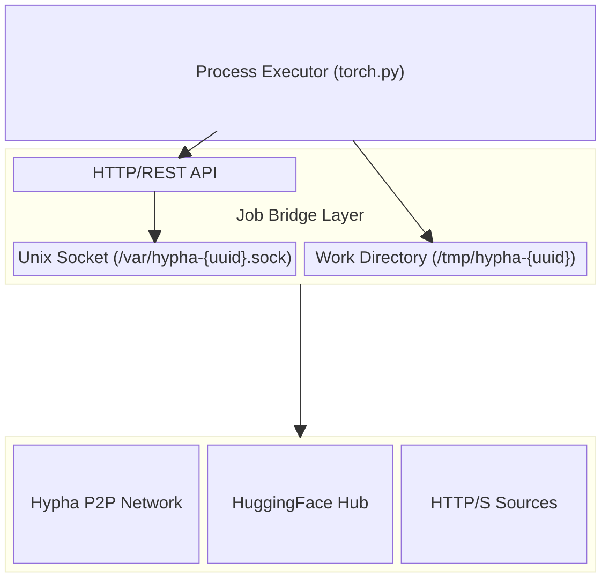

# Job Bridge Interface Specification

## Executive Summary

This RFC introduces the Job Bridge, a language-agnostic interface layer that mediates between executors and the Hypha network. By exposing a minimal HTTP/REST API over Unix domain sockets, the bridge enables secure, efficient communication while maintaining strict separation between execution logic and network complexity.

## Background

Workers should utilize battle-tested libraries to execute jobs such as PyTorch along with accompanying libraries. But rather than requiring each executor implementation to understand the full complexity of p2p networking, content addressing, and distributed protocols, we need a simple, uniform interface that:

- Allows executors written in any language to fetch resources from various sources (HTTP, HuggingFace, IPFS, peers, ...)
- Enables sending and receiving data to/from other peers in the network
- Provides a secure, isolated communication channel between the executor process and the worker
- Handles streaming data efficiently without requiring executors to implement complex streaming protocols
- Maintains clear separation of concerns between job execution logic and network/resource management

## Proposal

The proposal include a three-layer architecture that separates concerns while maintaining efficiency.

The Process Executor implements job-specific computational logic using domain-appropriate libraries and frameworks, communicating exclusively through the bridge API for all external resource operations. This design ensures executors remain focused on their core computational tasks without concerning themselves with network protocols or resource management complexity.




The Job Bridge serves as the critical mediation layer, providing a stateless HTTP interface that manages filesystem operations, enforces security policies, and translates between high-level executor requests and low-level connector operations. Its stateless nature ensures horizontal scalability and simplified failure recovery, while the HTTP interface guarantees broad compatibility across programming environments.

The Connector Layer abstracts diverse data sources behind a unified streaming interface, handling protocol-specific negotiations and managing connection lifecycle with appropriate error recovery strategies. This abstraction enables seamless integration of new data sources without modifying the bridge interface, preserving backward compatibility while enabling extensibility.

### API

The bridge API provides a set of `resource` operations. The API exchanges only metadata through JSON responses, returning filesystem paths and statistics rather than raw data, which maintains clear separation between control and data planes. Long-lived streaming connections utilize Server-Sent Events for _real-time_ updates, avoiding the complexity of WebSocket protocols while maintaining compatibility with standard HTTP infrastructure.

#### Resource Fetching

The unified fetching interface abstracts diverse data sources behind a consistent API, enabling executors to retrieve resources from HTTP endpoints, HuggingFace repositories, or peer nodes without understanding underlying protocols:

```http
POST /resources/fetch
Content-Type: application/json

{
  "fetch": {
    "type": "HuggingFace",
    "repository": "meta-llama/Llama-3.1-8B",
    "revision": "main",
    "filenames": ["model.safetensors", "config.json"]
  },
  "out_dir": "artifacts"
}
```

**Response Structure**:
```json
[
  {
    "path": "artifacts/model.safetensors",
    "size": 16534288384,
    "checksum": "sha256:abc123...",
    "metadata": {
      "source": "huggingface",
      "timestamp": "2025-01-15T10:30:00Z"
    }
  }
]
```

#### Sending Resources to a peer node

```http
POST /resources/send
Content-Type: application/json

{
  "send": {
    "type": "Peers",
    "peers": ["12D3KooWA...", "QmX7d..."],
    "strategy": "All" | "One" | "Random"
  },
  "path": "output/results.json"
}
```

##### Receiving Resources (Streaming) from a peer node

```http
POST /resources/receive
Content-Type: application/json

{
  "receive": {
    "type": "Peers",
    "peers": [],  // Empty for any peer
    "strategy": "All"
  },
  "out_dir": "incoming"
}
```

**Server-Sent Event Stream**:
```
data: {"path": "incoming/chunk-0.bin", "size": 1048576, "from_peer": "12D3Ko...", "sequence": 0}
data: {"path": "incoming/chunk-1.bin", "size": 1048576, "from_peer": "12D3Ko...", "sequence": 1}
```

### Connector Architecture

The connector layer implements a pluggable architecture supporting heterogeneous data sources through a trait-based design that enables compile-time verification and runtime flexibility:

```rust
pub trait FetchConnector: Send + Sync {
    fn supports(&self, reference: &Reference) -> bool;
    fn fetch<'a>(&'a self, fetch: &'a Fetch)
        -> Pin<Box<dyn Future<Output = Result<ReadItemStream, Error>> + 'a>>;
}
```

## Security Considerations

The bridge operates under conservative security assumptions that guide its defensive design. Schediulers and other peers as well as other processes may be compromised or malicious, requiring strict isolation boundaries and capability restrictions. Network peers may attempt to inject malformed data or exhaust resources through amplification attacks. The host filesystem requires protection from unauthorized access or modification, particularly preventing escape from designated work directories. Resource consumption must remain bounded and observable to prevent denial-of-service conditions that could impact other jobs or system stability.

1. **Process isolation**: Each job runs in a separate process with its own work directory
2. **Permission restrictions**: Unix socket and all created files use 0600 permissions
3. **Path validation**:
   - No absolute paths allowed
   - Parent directory traversal blocked
   - All paths confined to work directory
4. **Job isolation**: Each job should only have access to inputs meant for it.


> [!IMPORTANT]
> Please note that we don't have and probably never will provide a guard against malicious executors. Executors are configured along with the worker and thus need to be validated by the worker owner.

> [!WARNING]
> The current implementation does not provide any form of isolation between jobs. This means that a malicious job could potentially access or modify the files of another job or get inputs meant for another job. This is a significant security risk and should be addressed in future versions of the Job Bridge.

## Next Steps

The proposed Job Bridge only covers the initial mechanism. Future work will focus on improving security, and performance.

### Job Scope

Receive and the other methods should be scoped to the job to improve security – this will require careful consideration to properly route inouts i.e two jobs to receive inputs from the same peer while blocking inputs from other peers.

### Additional Connectors

Add additional connectors like S3-compatible object storage, but also BitSwap over the Hypha Network.

### Compression

Automatically compress or quantize data based on job requirements.
