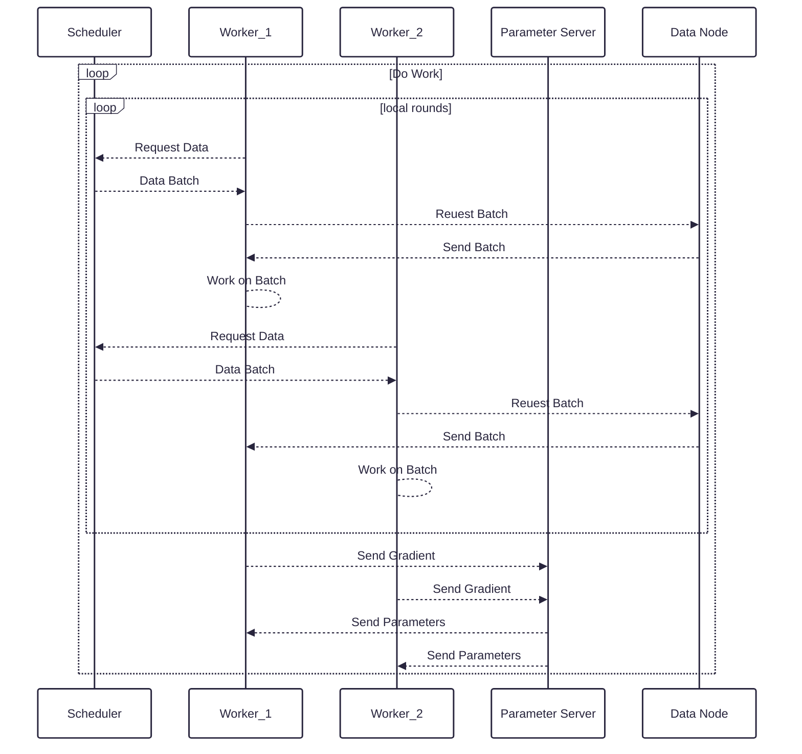
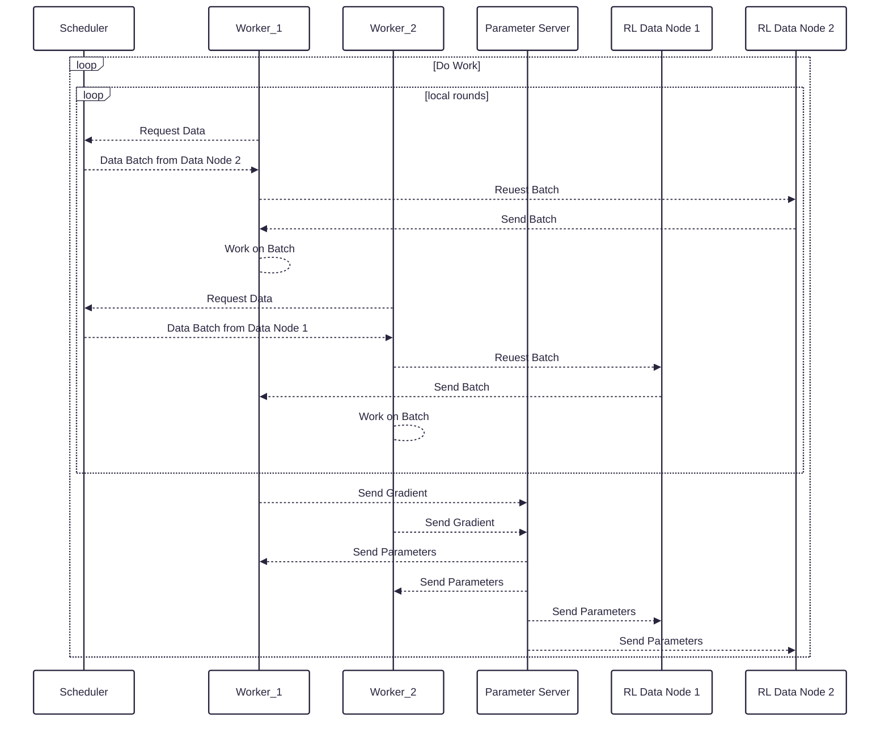

# Reinforcement Learning on Hypha

## Overview

As part of the SRIND challenge, we also want to add the capabilities to Hypha to run Reinforcement 
Learning (RL) workloads. Compared to the supervised or unsupervised training regime, RL works 
fundamentaly different. Thus, this RFC highlights where the concepts diverge and why this is a
challenge in the current version of Hypha. Then, it will propose a way on how to enable Hypha for RL
without breaking its concepts.

## Background

While (un-)supervised ML follows the schema of data being ingested by a model for training, RL comes without
any prepared training data. Instead, it needs a simulation (usually called an environment) of the process 
that should be solved. For example, this can be the environment for the Atari games, where the RL agent can send
actions that will be performed by the simulator. For the Atari games, this is something like pressing a button
to performing an action in the game.

Thus, the training process creates its own training data, and the training data is updated over time. This
doesen't fit into Hypha's current architecture, where data is served from a static, preprocessed dataset.
This architecture is depicted in belows diagram.

## Proposal

To enable RL, we need two things: Data Nodes that are capable of running an environment and multiple
Data Nodes because creating samples for the worker to train on is essential. What is beneficial in this
scenario is that RL models are usually quite small and don't need GPUs for inference. However, to
produce enough training samples, simulating the environment and running inference need to be fast. Thus,
RL Data Nodes are quite heavy on CPU load. In terms of heterogeneous hardware requirements, RL is a perfect
match for Hypha, since it will need both GPU- and CPU-powered workers.

To fulfill the first requirement, a special RL Data Node needs to be implemented. The Data Node needs to 
run the environment and the current model. Therefore, it will also need to be able to receive model updates.
The RL Data Node will run a continuous data generation process that should possibly run in parallel. The
resulting training data will be stored in a FIFO circular buffer. The buffer needs to provide random
access to the samples for training. To enhance efficiency, the buffer should also be held in memory for faster
access times.

The second requirement will be satisfied by improving the Scheduler to redirect Worker requests for data to
different RL Data Nodes. Thus, the Scheduler needs to balance latency between RL Data Nodes and Workers as
well as sampling and processing speed.

The above solution will look like the following.

