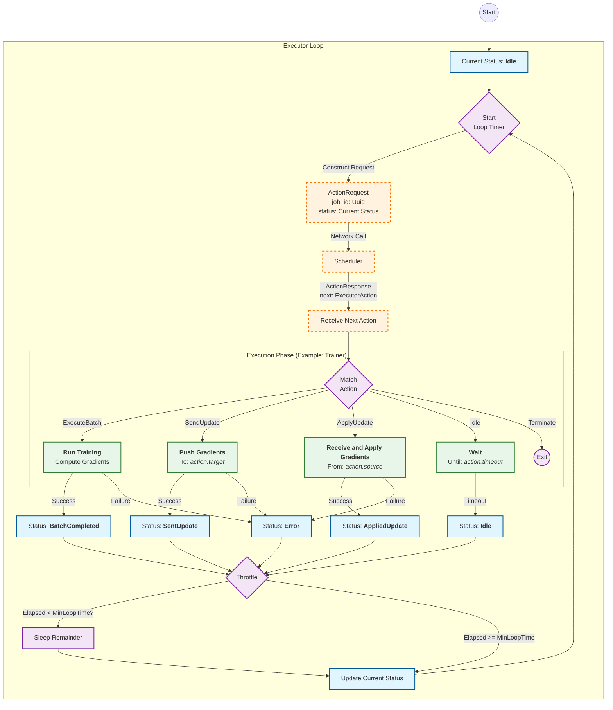

# Fault Tolerance via _Centralized_ (per Scheduler) Orchestration

## Overview

Hypha’s scheduler achieves resilience by combining allocator-driven pools with a pull-based action protocol. We are shifting from static jobs with fixed peer maps, which are brittle, to a _centralized_ orchestration model. In this new architecture, the Scheduler acts as the conductor, dynamically dictating actions to Workers and Parameter Servers. This _centralized_ control ensures that routing information remains current, enabling the seamless replacement of failed nodes without disrupting the overall job.

## Background

In previous iterations, workers relied on static network maps defined at the start of a job. This rigidity meant that if a worker failed, the routing information "baked" into the tasks became stale, effectively breaking the topology. Merely maintaining a pool of spare workers is insufficient if the running tasks cannot adapt to these topology changes.

To address this, we are introducing _Centralized_ (per Scheduler) Pull-Based Orchestration. Workers no longer hold static state; instead, they request instructions dynamically from the scheduler. The scheduler holds the single source of truth for cluster membership and routing, allowing it to seamlessly reroute traffic to new workers or parameter servers as the pool composition changes. This decoupling of execution from topology is the cornerstone of our fault tolerance strategy.

## Proposal

### The Core Concept: _Centralized_ Pull-Based Orchestration

The interaction model functions as a state machine where the Scheduler provides the intelligence and Workers/Parameter Servers act as pure executors. The architecture distinguishes clearly between the initialization phase and the runtime control loop.

The only "push" operation occurs during the Dispatch phase. When a worker joins the pool, the Scheduler actively initializes the `TrainExecutor` or `AggregateExecutor` on that node. This sets up the necessary environment but does not provide the full routing map.

From that point on, the control loop is entirely Pull-Based. A worker performs an atomic unit of work, such as a training batch, and then sends an `action::Request` to the Scheduler reporting its status. The Scheduler processes this state, updates its global view of the cluster, and returns an `action::Response`. This response contains not just the next command (e.g., `ExecuteBatch` or `SendUpdate`), but crucially, the specific, up-to-date peer list needed to execute that action.

### Protocol Definition: The Action Schema

To facilitate this dynamic orchestration, we introduce a robust `action` protocol. This protocol acts as the language between the "brain" (scheduler) and the "limbs" (executors). It is designed to be stateless on the executor side, with every necessary piece of context provided in the response.

The `action` module defines the communication protocol:

```rust
pub mod action {
    use super::*;
    use std::collections::HashMap;
    use serde::{Serialize, Deserialize};
    use uuid::Uuid;

    pub type Codec = CborCodec<ActionRequest, ActionResponse>;
    pub static IDENTIFIER: &str = "/hypha-action/0.0.1";

    /// The "Status" report from the Worker/PS to the Scheduler.
    #[derive(Clone, Debug, Serialize, Deserialize)]
    pub struct ActionRequest {
        pub job_id: Uuid,
        pub status: ExecutorStatus,
    }

    /// The "Command" from Scheduler to Worker/PS.
    #[derive(Clone, Debug, Serialize, Deserialize)]
    pub struct ActionResponse {
        pub job_id: Uuid,
        pub next: ExecutorAction,
    }
}
```

Status updates are namespaced by executor type to prevent ambiguity. This ensures that a "Completed" status is clearly contextualized, a train complete is distinct from an aggregation complete. This explicit typing simplifies the executor implementation, as the action types are clearly defined for each role.

```rust
#[derive(Clone, Debug, Serialize, Deserialize)]
#[serde(tag = "executor", content = "details", rename_all = "kebab-case")]
pub enum ExecutorStatus {
    Train(TrainStatus),
    Aggregate(AggregateStatus),
}

#[derive(Clone, Debug, Serialize, Deserialize)]
#[serde(tag = "state", rename_all = "kebab-case")]
pub enum TrainStatus {
    Idle,
    BatchCompleted { batch_size: u32 },
    SentUpdate,
    AppliedUpdate { 
        // Metrics sent after an update was received and processed.
        round: u32,
        metrics: HashMap<String, f32>
    },
    Terminated,
    Error(TrainError),
}

#[derive(Clone, Debug, Serialize, Deserialize)]
#[serde(tag = "type", rename_all = "kebab-case")]
pub enum TrainError {
    Connection { message: String },
    Other { message: String },
}

#[derive(Clone, Debug, Serialize, Deserialize)]
#[serde(tag = "state", rename_all = "kebab-case")]
pub enum AggregateStatus {
    Idle,
    AggregatedUpdates {
        metrics: Option<HashMap<String, f32>>,
    },
    BroadcastedUpdate {
        metrics: Option<HashMap<String, f32>>,
    }, 
    Terminated,
    Error(AggregateError),
}

#[derive(Clone, Debug, Serialize, Deserialize)]
#[serde(tag = "type", rename_all = "kebab-case")]
pub enum AggregateError {
    Connection { message: String },
    Other { message: String },
}
```

Similarly, actions sent from the scheduler include mandatory `Reference` fields. This is the mechanism that enables dynamic routing: whenever networking is required (like `SendUpdate` or `BroadcastUpdate`), the executor receives the current, valid routing targets embedded directly in the command.

```rust
#[derive(Clone, Debug, Serialize, Deserialize)]
#[serde(tag = "executor", content = "action", rename_all = "kebab-case")]
pub enum ExecutorAction {
    Train(TrainAction),
    Aggregate(AggregateAction),
}

#[derive(Clone, Debug, Serialize, Deserialize)]
#[serde(tag = "kind", rename_all = "kebab-case")]
pub enum TrainAction {
    Idle {
        timeout: SystemTime,
    },
    ExecuteBatch,
    SendUpdate {
        target: Reference, 
        timeout: SystemTime
    },
    ApplyUpdate {
        source: Reference,
        timeout: SystemTime
    },
    Terminate,
}

#[derive(Clone, Debug, Serialize, Deserialize)]
#[serde(tag = "kind", rename_all = "kebab-case")]
pub enum AggregateAction {
    Idle {
        timeout: SystemTime,
    },
    
    AggregateUpdates {
        source: Reference,
    },

    BroadcastUpdate {
        target: Reference,
    },

    Terminate,
}
```

### The Executor Loop: A Tick-Based State Machine

All executors adhere to a strict, tick-based state machine design. This loop is guided by four key principles that ensure stability and responsiveness without overwhelming the central controller.

First, the **Scheduler is the Single Source of Truth**. The executor does not decide what to do next; it simply asks. Second, a Throttle (e.g., 100ms) is enforced to prevent short actions (like a repeated `Idle` state) from hammering the Scheduler with requests for what to do next. Third, every request explicitly carries the `job_id` for context, allowing the scheduler to theoratically  multiplex many jobs effortlessly. Finally, routing is embedded: network actions receive their targets immediately before execution, ensuring no stale peers are ever contacted.



### Resource Management

The scheduler relies on managed pools to maintain compute resources and drive execution. The `Pool` acts as a `Stream` that yields new workers as they are allocated, enabling a reactive, concurrent dispatch model. By consuming this stream, the scheduler can dispatch task specifications to multiple workers in parallel immediately upon their arrival. This responsiveness ensures that replacement workers, provisioned to meet the `target` count, are integrated into the job with minimal latency.

Routing in a fault-tolerant system requires frequent, low-latency access to the current cluster membership. To achieve this, the pool maintains membership in an `ArcSwap`, allowing the `BatchScheduler` to snapshot the active peer list instantly for every `ActionResponse` without blocking. `PoolWithStatistics` layers runtime metrics, such as the last update time, on top of this membership. This creates a single source of truth, ensuring that scheduling decisions—like determining if a quorum is met, are based on a unified view of both connectivity and application progress.

To maintain the cluster state, a background reconciliation loop continually matches the pool size to the `target` configuration. Configurable parameters such as `min` (establishing a quorum floor) and `grace` (defining a timeout before abort) allow the system to tolerate transient failures without terminating the job, provided the pool recovers within the specified window.

### Rationale and Operational Notes

This design simplifies the executors into "dumb" state machines, dramatically reducing the complexity of distributed state synchronization. By removing baked-in peer lists, the cluster can survive node failures: new nodes are simply added to the scheduler's pool and immediately become valid targets for the next action.

Operationally, this resilience is supported by configurable grace windows. These prevent immediate job failure during transient network issues or node replacements.

The system's resilience was rigorously validated using `scripts/flaky-runner.sh`, a simple tool designed to simulate a 5% failure rate every 10-20 seconds for worker processes with a downtime of 10 to 30 seconds. These tests robustly demonstrated that training progresses successfully even under such a high rate of worker churn, though at a significantly slower pace compared to more stable environments. This highlights the inherent trade-off between achieving absolute reliability and ensuring task completion amidst frequent disruptions. Furthermore, it was observed that conducting these tests using static ports and direct IP addresses was critical. Otherwise stale DHT records could introduced additional delays and instability, particularly when a limited number of workers were available for a given executor type, underscoring the importance of precise network addressing for optimal fault tolerance.
