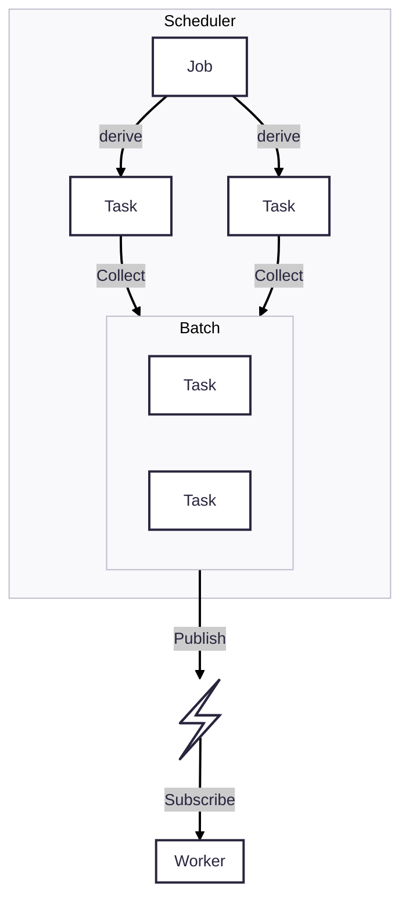
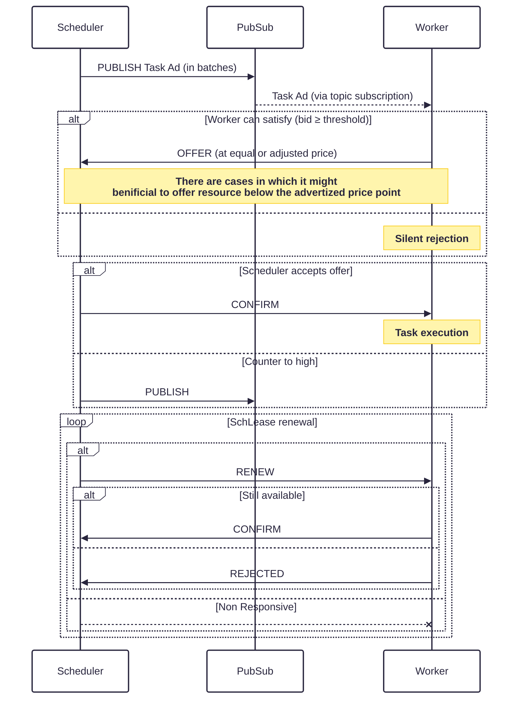

# Decentralized Resource Allocation Protocol

## Overview


This RFC proposes a Decentralized Resource Allocation Protocol (dRAP). It enables fully decentralized discovery and efficient matching between schedulers and workers via a publish/subscribe overlay network. Instead of having schedulers query workers, schedulers publish “task advertisements” (task-ads), and workers respond if they can run the task. Workers can counter the offered price while schedulers pick the best price from the set of responding workers providing a fast bounded negotiation with the _prices_ used to balancing load across workers as well as a signal to add more resource to the network. The main goals are:

* Fully decentralized discovery and matching via pub-sub overlay (Gossipsub)
* Per-worker micro-auctions through a single round of counter-offers to negotiate an appropriate virtual price for the requested resource bundle.
* Support for heterogeneous, multi-resource tasks (e.g., GPU, CPU, RAM, disk) with fractional sharing (MIG/time-slices) and preemption.
* Fast convergence (placement within ≲1 second) and high utilization without central coordination
* Scalable support for complex ML workloads spanning multiple workers

## Background

Large‑model workloads easily exceed a single GPU’s memory. Existing solutions fall into two buckets:

* **Central clusters** (Kubernetes, Ray, Slurm) – high CAPEX/OPEX, single point of failure
* **Ad‑hoc P2P systems** (SWARM, Petals) – Lack's abbillity to dynamically form _swarms_ across connected peers.

We need a **unified, minimal protocol** that:

* Maintains a _tiny_ protocol overhead (one publish, one bid, one confirm message)
* Allows one job to span **many peers** and **change topology**
* Survives churn, slow links, and partial Byzantine behaviour

Both SWARM and Petals are built on libp2p via hivemind and provide functionality aligned with Hypha's goals but lack **mechanisms** to form _swarms_ across connected peers. While many of the existing decentralized scheduling and resource allocation mechanisms do not have the right properties (i.e. slow convergence) for the heterogeneous environments and workloads.

Per-worker market-based allocation (Tycoon, Eger & Killat’s P2P pricing) propose that each node runs a small auction for its own resources. This yields high utilization and fairness, but comes with a rather high communication overhead due to the many action rounds. Randomized sampling schedulers (i.e. Sparrow) allow schedulers to sample and probe a few random workers, but they lack multi-resource expressiveness and incentive signals. Combinatorial auctions enable scheduling complex bundles of resources but usually rely on a central auctioneer for winner determination, violating decentralization.

This RFC builds on the strengths of the different mechanisms and addresses the gaps by inverting the signaling pattern and limiting the auction rounds: Schedulers “push” task-ads (or batches of task-ads) to subscribed workers, and each worker locally decides whether to bid (counter-offer) or _reject_. This ensures:

* No central auctioneer: All matching happens via pub-sub and one round of RPC message exchange.
* Multi-resource matching: Task-ads carry full vectors of requirements; workers only respond if they can satisfy them.
* Dynamic pricing signals: Each worker maintains a local “price threshold” that adjusts automatically with utilization and task-ads signal willingness to pay based on their current needs and available resources.
* Fast, bounded negotiation: Exactly one worker -> scheduler counter-offer and one scheduler -> worker confirmation (max 4 messages).

## Proposal

* Schedulers: Clients that “publish” tasks. They encapsulate resource requirements, estimated duration, and an initial bid (priority/virtual price).
* Workers: Nodes that subscribe to resource-specific topics. They maintain:
  * Current free capacity for each resource type (GPU, CPU, RAM, Disk).
  * A local price threshold (per resource or composite) that rises/falls with utilization.
  * A small in-memory queue of pending task-ads they are considering.

Principles:

* **Decentralization**: No central auctioneer, only per-node micro-negotiations
* **Bounded Negotiation**: Maximum 4-message exchange per task allocation
* **Multi-Resource Matching**: Workers only respond if they can satisfy entire resource bundles
* **Lease-Based Execution**: Tasks run for discrete time slots with renewal mechanisms
* **Adaptive Topology**: Multi-segment jobs can rebalance and reroute at runtime




### Message Flow




### 9. Fault Tolerance & Recovery

#### Worker Failure Detection

* **Lease Expiry**: Tasks without successful renewal are considered failed
* **Heartbeat Mechanism**: Optional periodic health checks for long-running jobs
* **Stream Failure**: Router components detect broken tensor streams and failover

#### State Synchronization

For stateful workloads (training), workers can implement checkpointing:

### 10. Security & Spam Mitigation

#### Authentication & Authorization

* **Identity Verification**: All messages signed with libp2p peer IDs
* **Job Allowlists**: Workers can maintain lists of trusted schedulers
* **Resource Quotas**: Per-scheduler limits on concurrent resource usage


### 11. Performance Optimizations

#### Message Batching

## Conclusion

The Decentralized Resource Allocation Protocol provides a unified framework for both simple task allocation and complex multi-segment ML workloads in federated environments. By building on proven distributed systems principles, pub-sub discovery, market-based allocation, lease-based fault tolerance, dRAP achieves:

1. **Scalability**: Topic-based message filtering and bounded negotiation rounds
2. **Expressiveness**: Support for heterogeneous resources and complex job topologies
3. **Fairness**: Virtual bidding with dynamic price thresholds
4. **Low Latency**: Sub-second task placement through efficient protocols
5. **Fault Tolerance**: Automatic failover and recovery mechanisms
6. **Flexibility**: Extensible message formats supporting diverse ML workloads

This protocol serves as a foundation for building large-scale federated AI platforms where no single scheduler should hold global state, and any worker should autonomously decide when and how to execute tasks. The design enables everything from simple batch processing to complex distributed training scenarios while maintaining the decentralization and performance characteristics required for modern AI infrastructure.

## Appendix A: Message Flow Examples

### Job

```json{
  "$schema": "https://json-schema.org/draft/2020-12/schema",
  "$id": "https://example.com/schemas/job.schema.json",
  "type": "object",
  "properties": {
    "resources": {
      "type": "object",
      "properties": {
        "gpu": {
          "$ref": "#/$defs/resource"
        },
        "cpu": {
          "$ref": "#/$defs/resource"
        },
        "disk": {
          "$ref": "#/$defs/resource"
        }
      }
    },
    "driver": {
      "oneOf": [
        {
          "$ref": "#/$defs/torch_driver"
        },
        {
          "$ref": "#/$defs/candle_driver"
        }
      ]
    }
  },
  "required": [
    "driver"
  ],
  "$defs": {
    "resource": {
      "type": "object",
      "properties": {
        "min": {
          "type": "number"
        }
      },
      "required": [
        "min"
      ],
      "additionalProperties": false
    },
    "cids": {
      "type": "array",
      "item": {
        "type": "string"
      },
      "minItems": 1
    },
    "torch_driver": {
      "type": "object",
      "properties": {
        "kind": {
          "const": "torch"
        },
        "model": {
          "$ref": "#/$defs/cids"
        },
        "lossFunction": {
          "type": "string",
          "enum": [
            "cross_entropy",
            "mse"
          ]
        },
        "optimizer": {
          "type": "string",
          "enum": [
            "adamw",
            "sgd"
          ]
        }
      },
      "required": [
        "kind",
        "model",
        "lossFunction",
        "optimizer"
      ],
      "additionalProperties": false
    },
    "candle_driver": {
      "type": "object",
      "properties": {
        "kind": {
          "const": "candle"
        },
        "modelUri": {
          "type": "string",
          "format": "uri"
        }
      },
      "required": [
        "kind",
        "modelUri"
      ],
      "additionalProperties": false
    }
  }
}```

### Single Task Example

```json

```

---

# CBOR Message Flow and Bin Packing Logic

## CBOR Serialization Pattern

### Rust to Network Flow

```rust
// 1. Define Rust struct with serde
#[derive(Serialize, Deserialize, Debug)]
#[serde(rename_all = "snake_case")]
struct TaskAdvertisement {
    #[serde(with = "uuid_serde")]
    advertisement_id: Uuid,
    scheduler_id: String,  // base58 encoded PeerId
    tasks: Vec<TaskSpec>,
    #[serde(with = "chrono::serde::ts_seconds")]
    publish_time: DateTime<Utc>,
}

// 2. Serialize to CBOR
let ad = TaskAdvertisement { ... };
let cbor_bytes = serde_cbor::to_vec(&ad)?;

// 3. Publish to network
gossipsub.publish(topic, cbor_bytes);
```

### JSON Schema for Documentation

```json
{
  "$schema": "https://json-schema.org/draft/2020-12/schema",
  "$id": "https://drap.io/schemas/task_advertisement.json",
  "type": "object",
  "properties": {
    "advertisement_id": {
      "type": "string",
      "format": "uuid"
    },
    "scheduler_id": {
      "type": "string",
      "pattern": "^[123456789ABCDEFGHJKLMNPQRSTUVWXYZabcdefghijkmnopqrstuvwxyz]+$"
    },
    "tasks": {
      "type": "array",
      "items": { "$ref": "#/$defs/task_spec" }
    },
    "publish_time": {
      "type": "integer",
      "description": "Unix timestamp"
    }
  },
  "required": ["advertisement_id", "scheduler_id", "tasks", "publish_time"],
  "$defs": {
    "task_spec": {
      "type": "object",
      "properties": {
        "task_id": { "type": "string", "format": "uuid" },
        "resources": { "$ref": "#/$defs/resource_requirements" },
        "duration_estimate": { "type": "integer" },
        "deadline": { "type": "integer" },
        "bid_floor": { "type": "number" }
      }
    }
  }
}
```

### Network to Rust Flow

```rust
// Receive CBOR bytes from network
let cbor_data: Vec<u8> = gossipsub.receive();

// Deserialize with validation
match serde_cbor::from_slice::<TaskAdvertisement>(&cbor_data) {
    Ok(ad) => process_advertisement(ad),
    Err(e) => log::warn!("Invalid advertisement: {}", e),
}
```

## Worker Bin Packing Algorithm

### Conceptual Overview

Workers treat resource allocation as a multi-dimensional bin packing problem where:
- The "bin" is the worker's available resources
- "Items" are tasks from buffered advertisements
- Goal: Maximize revenue while minimizing fragmentation

### High-Level Algorithm

```rust
struct BinPacker {
    available_resources: ResourceBundle,
    buffered_tasks: Vec<(TaskSpec, f64)>,  // (task, profitability_score)
    selection_strategy: PackingStrategy,
}

enum PackingStrategy {
    GreedyByProfit,      // Highest profit first
    GreedyByDensity,     // Highest profit/resource ratio
    BestFit,             // Minimize wasted resources
    HybridOptimal,       // Combination approach
}
```

### Packing Process

1. **Collection Phase** (0-50ms)
   ```
   Buffer incoming task advertisements
   Calculate profitability score for each task
   ```

2. **Sorting Phase**
   ```
   Sort tasks by selected strategy metric
   Filter out tasks that exceed any resource dimension
   ```

3. **Packing Phase**
   ```
   For each task in sorted order:
     If task fits in remaining resources:
       Add to selected set
       Deduct resources
     Else:
       Skip task (doesn't fit)
   ```

4. **Pricing Phase**
   ```
   Calculate bundle price based on:
   - Individual task bid floors
   - Current utilization after packing
   - Market competition estimate
   ```

### Example Packing Scenario

Worker State:
- Available: 4 GPU, 32 CPU cores, 128GB RAM
- Current utilization: 50%

Buffered Tasks:
```
Task A: 2 GPU, 16 CPU, 64GB RAM, bid_floor: $10/hr
Task B: 1 GPU, 8 CPU, 32GB RAM, bid_floor: $5/hr
Task C: 2 GPU, 8 CPU, 32GB RAM, bid_floor: $8/hr
Task D: 1 GPU, 16 CPU, 64GB RAM, bid_floor: $7/hr
```

Greedy by Density Packing:
1. Calculate profit density (profit per resource unit)
2. Sort: B > C > D > A
3. Pack: B (fits) → C (fits) → D (doesn't fit - insufficient RAM) → A (doesn't fit)
4. Result: Offer tasks B and C for total $13/hr

### Risk Mitigation

Workers balance between:
- **Aggressive packing**: Higher utilization but risk of losing all tasks
- **Conservative packing**: Lower utilization but higher win probability

Strategies:
- Offer slight discount on bundle to increase win probability
- Reserve buffer resources for high-value tasks
- Track historical win rates to tune aggressiveness

## Message Size Optimization

CBOR provides efficient binary encoding:

| Field Type | JSON Size | CBOR Size | Savings |
|------------|-----------|-----------|---------|
| UUID | 36 bytes | 16 bytes | 55% |
| Timestamp | 24 bytes | 8 bytes | 67% |
| Float | 8-15 bytes | 4-8 bytes | 40% |
| Small Int | 3-5 bytes | 1-2 bytes | 60% |

Example advertisement with 10 tasks:
- JSON: ~2KB
- CBOR: ~800 bytes
- Compression: 60% reduction

## Topic Subscription Strategy

Workers dynamically adjust subscriptions based on:

```
High Capacity Worker (many resources):
  → Subscribe to more topic shards
  → Can handle diverse task types
  → Higher message volume acceptable

Low Capacity Worker (few resources):
  → Subscribe to fewer, specific shards
  → Focus on best-fit task types
  → Reduce message processing overhead
```

This ensures workers only receive relevant task advertisements, reducing network and processing overhead.

---

# Decentralized Resource Allocation Protocol (dRAP) - High Level Design

## Core Concept

dRAP inverts traditional scheduler-worker communication. Instead of workers advertising availability, schedulers broadcast task requirements to the network. Workers subscribe to relevant topics and respond only when they can profitably execute tasks.

## Protocol Flow

### 1. Task Advertisement
Schedulers publish task requirements to gossipsub topics. Multiple task advertisements are bundled into a single message to reduce network overhead.

```
Scheduler → Gossipsub Topic → Subscribed Workers
```

### 2. Worker Evaluation
Workers receive task advertisements and:
- Buffer incoming ads briefly (≤50ms) to enable batch processing
- Apply bin packing algorithms to maximize resource utilization
- Calculate prices based on current utilization and market conditions
- Respond with offers only for profitable task combinations

### 3. Offer & Confirmation
```
Worker → Direct RPC → Scheduler (Offer)
Scheduler → Direct RPC → Worker (Confirmation)
```

### 4. Execution
Confirmed tasks enter the worker's priority queue, ordered by deadline, and execute within their allocated resource envelope and lease duration.

## Message Serialization

All messages use CBOR encoding with the following flow:

```
Rust Struct → CBOR → Network → CBOR → Rust Struct
         ↓                               ↑
    JSON Schema (for documentation/validation)
```

## Core Message Types

### TaskAdvertisement
Groups multiple tasks that a scheduler wants to execute. This is purely a network optimization - tasks may run on different workers.

```rust
struct TaskAdvertisement {
    advertisement_id: Uuid,
    scheduler_id: PeerId,
    tasks: Vec<TaskSpec>,
    publish_time: DateTime<Utc>,
}

struct TaskSpec {
    task_id: Uuid,
    resources: ResourceRequirements,
    duration_estimate: Duration,
    deadline: DateTime<Utc>,
    bid_floor: f64,  // Minimum price scheduler will accept
    driver: TaskDriver,
}
```

### WorkerOffer
A worker's response indicating which tasks it can execute and at what price.

```rust
struct WorkerOffer {
    offer_id: Uuid,
    advertisement_id: Uuid,
    worker_id: PeerId,
    task_bids: Vec<TaskBid>,
    valid_until: DateTime<Utc>,
}

struct TaskBid {
    task_id: Uuid,
    offered_price: f64,
    earliest_start: DateTime<Utc>,
}
```

### SchedulerConfirmation
Final task assignment with lease details.

```rust
struct SchedulerConfirmation {
    confirmation_id: Uuid,
    offer_id: Uuid,
    accepted_tasks: Vec<TaskAssignment>,
}

struct TaskAssignment {
    task_id: Uuid,
    lease_id: Uuid,
    lease_duration: Duration,
    execution_params: HashMap<String, Value>,
}
```

## Worker Architecture

### Components

1. **Network Interface**
   - Manages gossipsub subscriptions
   - Handles CBOR serialization/deserialization
   - Routes messages between network and internal components

2. **Market Arbiter**
   - Buffers incoming task advertisements
   - Applies bin packing algorithm to maximize resource sale
   - Calculates competitive prices
   - Generates and sends offers

3. **Resource Manager**
   - Tracks available capacity across all resource dimensions
   - Maintains utilization history
   - Updates pricing thresholds

4. **Task Executor**
   - Priority queue of confirmed tasks
   - Enforces resource limits
   - Manages lease lifecycle
   - Reports task completion/failure

### Bin Packing Strategy

Workers aim to fill their resource capacity efficiently while maintaining price competitiveness:

1. **Buffer Period**: Collect task advertisements for up to 50ms
2. **Sort Strategy**: Order tasks by profitability density (profit per resource unit)
3. **Pack Algorithm**: Greedily select tasks that:
   - Fit within available resources
   - Maximize total revenue
   - Leave minimal resource fragmentation
4. **Price Adjustment**: May offer below advertised price to win entire profitable bundle

## Topics Structure

Workers subscribe to topics matching their capabilities:

```
/drap/1.0.0/tasks/{resource_class}/{region}/{shard}

Examples:
/drap/1.0.0/tasks/gpu/us-east/0
/drap/1.0.0/tasks/cpu/global/5
/drap/1.0.0/tasks/highmem/eu-west/2
```

## Pricing Dynamics

### Worker Pricing
- Base price determined by resource type and local costs
- Utilization multiplier (exponential above 80% capacity)
- Time-based adjustments (peak/off-peak)
- Competition awareness through market observation

### Scheduler Strategy
- Set bid floor based on task urgency
- May accept higher prices for immediate execution
- Can republish with higher bids if no acceptable offers

## Multi-Segment Jobs

For complex workloads (e.g., distributed training), schedulers:

1. **Decompose** job into individual tasks
2. **Publish** all tasks in one advertisement
3. **Coordinate** inter-task communication via overlay network
4. **Manage** dynamic topology as tasks complete/fail

Example: A distributed training job might publish:
- 4 data loader tasks (CPU-heavy)
- 8 gradient computation tasks (GPU-heavy)
- 1 parameter server task (memory-heavy)

Each task type attracts different workers based on their resource profiles.

## Fault Tolerance

### Lease-Based Execution
- All tasks run under time-bounded leases
- Automatic renewal before expiration
- Graceful migration on non-renewal

### Failure Detection
- Missing lease renewal indicates worker failure
- Scheduler republishes task for new worker
- Optional checkpointing for stateful tasks

### Network Partitions
- Gossipsub provides eventual consistency
- Direct RPC has timeout/retry logic
- Tasks continue execution during temporary disconnections

## Security Model

1. **Identity**: All participants have libp2p peer IDs
2. **Message Authentication**: CBOR messages include signatures
3. **Resource Limits**: Workers enforce per-scheduler quotas
4. **Reputation**: Optional reputation system based on completion rates

## Performance Characteristics

- **Discovery Latency**: ~100ms (gossipsub propagation)
- **Negotiation Time**: ~200ms (one round of offers)
- **Total Placement**: <500ms for most tasks
- **Network Overhead**: O(tasks) messages, bundled for efficiency
- **Scalability**: 10k+ workers via topic sharding

## Economic Incentives

The protocol creates a real-time spot market where:
- Workers compete on price and availability
- Schedulers balance cost vs. execution speed
- Prices signal when to add capacity
- Efficient resource utilization emerges naturally

This design enables fully decentralized scheduling without central coordination while maintaining sub-second task placement latency.

---
# Performance Optimizations

## Message Batching

To reduce network overhead and improve throughput, both schedulers and workers implement intelligent batching:

### Scheduler-Side Batching

```rust
pub struct TaskBatcher {
    pending_tasks: Vec<Task>,
    batch_size: usize,
    max_wait_time: Duration,
    last_batch_time: Instant,
}

impl TaskBatcher {
    pub async fn add_task(&mut self, task: Task) -> Option<TaskBatch> {
        self.pending_tasks.push(task);

        // Batch if size threshold reached OR timeout exceeded
        if self.pending_tasks.len() >= self.batch_size ||
           self.last_batch_time.elapsed() > self.max_wait_time {
            return Some(self.create_batch());
        }
        None
    }

    fn create_batch(&mut self) -> TaskBatch {
        let tasks = std::mem::take(&mut self.pending_tasks);
        self.last_batch_time = Instant::now();

        // Group by resource similarity for better matching
        let grouped = self.group_by_resources(tasks);

        TaskBatch {
            batch_id: Uuid::new_v4(),
            tasks: grouped,
            timestamp: Utc::now(),
        }
    }
}
```

### Worker-Side Offer Aggregation

Workers can respond to batches with aggregated offers:

```rust
impl Arbiter {
    async fn handle_task_batch(&mut self, batch: TaskBatch) {
        let mut viable_tasks = Vec::new();
        let mut total_resources = ResourceBundle::default();

        // Check which tasks we can handle
        for task in &batch.tasks {
            if self.can_accommodate(&task.resources, &total_resources) {
                viable_tasks.push(task.task_id);
                total_resources.add(&task.resources);
            }
        }

        if !viable_tasks.is_empty() {
            let batch_offer = BatchOffer {
                batch_id: batch.batch_id,
                task_ids: viable_tasks,
                aggregate_price: self.pricing_engine.batch_price(&total_resources),
                valid_until: Utc::now() + Duration::seconds(30),
            };

            self.send_batch_offer(batch.scheduler_id, batch_offer).await;
        }
    }
}
```

## Topic Sharding for Scalability

To handle high message volumes, topics are automatically sharded:

```
/drap/1.0.0/tasks/gpu/shard-{0-255}     # 256 shards for GPU tasks
/drap/1.0.0/tasks/cpu/shard-{0-255}     # 256 shards for CPU tasks
```

Workers subscribe to a subset of shards based on their capacity:

```rust
fn determine_shard_subscriptions(capacity: &ResourceCapacity) -> Vec<u8> {
    let num_shards = match capacity.total_compute_units() {
        0..=10 => 1,      // Small workers: 1 shard
        11..=50 => 4,     // Medium workers: 4 shards
        51..=200 => 16,   // Large workers: 16 shards
        _ => 64,          // Mega workers: 64 shards
    };

    // Deterministic shard selection based on peer ID
    let mut shards = Vec::new();
    let peer_hash = hash(peer_id);
    for i in 0..num_shards {
        shards.push((peer_hash + i) % 256);
    }
    shards
}
```

# Multi-Segment Job Support

## Job Topology Definition

Complex ML workloads are expressed as directed acyclic graphs (DAGs):

```json
{
  "job_id": "training_job_123",
  "topology": {
    "segments": [
      {
        "segment_id": "data_loader",
        "type": "data_parallel",
        "tasks": 4,
        "resources_per_task": {
          "cpu": { "cores": 4 },
          "memory": { "gb": 32 }
        },
        "outputs": ["forward_0", "forward_1"]
      },
      {
        "segment_id": "forward_0",
        "type": "tensor_parallel",
        "tasks": 2,
        "resources_per_task": {
          "gpu": { "count": 2, "type": "A100" }
        },
        "inputs": ["data_loader"],
        "outputs": ["backward_0"]
      },
      {
        "segment_id": "backward_0",
        "type": "tensor_parallel",
        "tasks": 2,
        "resources_per_task": {
          "gpu": { "count": 2, "type": "A100" }
        },
        "inputs": ["forward_0"],
        "outputs": ["optimizer"]
      }
    ],
    "data_flow": {
      "type": "streaming",
      "checkpoint_interval": 1000
    }
  }
}
```

## Router Component for Tensor Streams

The Router handles inter-segment communication:

```rust
pub struct TensorRouter {
    segment_id: String,
    peers: HashMap<String, Vec<PeerId>>,  // segment -> workers
    streams: HashMap<StreamId, TensorStream>,
    routing_strategy: RoutingStrategy,
}

#[derive(Clone)]
pub enum RoutingStrategy {
    RoundRobin,
    LoadBalanced,
    Affinity(HashMap<TensorKey, PeerId>),
}

impl TensorRouter {
    pub async fn route_tensor(
        &mut self,
        tensor: Tensor,
        target_segment: &str
    ) -> Result<()> {
        let target_peers = self.peers.get(target_segment)
            .ok_or("Unknown segment")?;

        let peer = match &self.routing_strategy {
            RoutingStrategy::RoundRobin => {
                self.next_peer_round_robin(target_peers)
            },
            RoutingStrategy::LoadBalanced => {
                self.select_least_loaded_peer(target_peers).await?
            },
            RoutingStrategy::Affinity(map) => {
                map.get(&tensor.key())
                    .or_else(|| self.next_peer_round_robin(target_peers))
            }
        };

        // Stream tensor to selected peer
        let stream = self.get_or_create_stream(peer).await?;
        stream.send_tensor(tensor).await?;

        Ok(())
    }
}
```

## Dynamic Topology Adjustment

Jobs can request topology changes during execution:

```rust
pub struct TopologyManager {
    current_topology: JobTopology,
    scheduler_connection: SchedulerConn,
}

impl TopologyManager {
    pub async fn request_scale_out(&mut self, segment: &str, factor: u32)
        -> Result<()> {
        let request = TopologyChange {
            job_id: self.current_topology.job_id.clone(),
            changes: vec![
                SegmentChange::ScaleOut {
                    segment_id: segment.to_string(),
                    additional_tasks: factor
                }
            ],
            reason: "Performance bottleneck detected".to_string(),
        };

        self.scheduler_connection.send(request).await?;
        Ok(())
    }
}
```

# Complete Message Flow Examples

## Example 1: Simple Batch Processing

```json
{
  "version": "1.0.0",
  "batch_id": "batch_abc123",
  "scheduler_id": "12D3KooWH3uVF6wv47WnArKHk5ZDaZ6ohzfXxvmfnj6Bjqk7pXYk",
  "publish_time": "2024-01-20T10:00:00Z",
  "tasks": [
    {
      "task_id": "resize_001",
      "resources": {
        "cpu": { "cores": 2 },
        "memory": { "gb": 4 }
      },
      "duration_estimate": 60,
      "initial_bid": 0.5,
      "deadline": "2024-01-20T10:30:00Z",
      "driver": {
        "kind": "container",
        "image": "ipfs://QmImageProcessor",
        "command": ["python", "resize.py", "--input", "${INPUT_CID}"]
      }
    },
    {
      "task_id": "resize_002",
      "resources": {
        "cpu": { "cores": 2 },
        "memory": { "gb": 4 }
      },
      "duration_estimate": 60,
      "initial_bid": 0.5,
      "deadline": "2024-01-20T10:30:00Z",
      "driver": {
        "kind": "container",
        "image": "ipfs://QmImageProcessor",
        "command": ["python", "resize.py", "--input", "${INPUT_CID}"]
      }
    }
  ],
  "batch_constraints": {
    "max_workers": 10,
    "prefer_colocated": false
  }
}
```

## Example 2: Distributed Training Job

```json
{
  "version": "1.0.0",
  "job_id": "llm_training_7890",
  "scheduler_id": "12D3KooWH3uVF6wv47WnArKHk5ZDaZ6ohzfXxvmfnj6Bjqk7pXYk",
  "job_type": "distributed_training",
  "topology": {
    "pipeline_stages": 4,
    "tensor_parallel_size": 2,
    "data_parallel_size": 2,
    "segments": [
      {
        "segment_id": "stage_0",
        "segment_type": "pipeline_stage",
        "replicas": 4,
        "resources_per_replica": {
          "gpu": {
            "count": 2,
            "memory_gb": 40,
            "type": "A100",
            "interconnect": "nvlink"
          },
          "cpu": { "cores": 16 },
          "memory": { "gb": 128 },
          "network": { "bandwidth_gbps": 100 }
        },
        "model_shards": ["layers_0_8"],
        "duration_estimate": 86400,
        "initial_bid": 50.0
      }
    ]
  },
  "coordination": {
    "rendezvous_endpoint": "/drap/jobs/llm_training_7890/coord",
    "checkpoint_interval": 1000,
    "failure_recovery": "resume_from_checkpoint"
  }
}
```

## Example 3: Worker Counter-Offer

```json
{
  "version": "1.0.0",
  "offer_id": "offer_xyz789",
  "worker_id": "12D3KooWBgPFQF6k2Wy4MKV1Ao3cUfRJqA5p7VfLNqRdTBMfH5mQ",
  "batch_id": "batch_abc123",
  "offers": [
    {
      "task_id": "resize_001",
      "price": 0.45,
      "price_model": "per_second",
      "available_from": "2024-01-20T10:02:00Z",
      "available_until": "2024-01-20T14:00:00Z",
      "guaranteed_duration": 3600,
      "resources_available": {
        "cpu": {
          "cores": 8,
          "architecture": "x86_64",
          "model": "Intel Xeon Gold 6248"
        },
        "memory": {
          "gb": 32,
          "bandwidth_gbps": 25.6
        }
      },
      "location": {
        "region": "us-east",
        "zone": "us-east-1a"
      }
    }
  ],
  "bulk_discount": {
    "threshold": 5,
    "discount_percent": 10
  },
  "signature": "0x1234...abcd"
}
```

## Example 4: Scheduler Confirmation

```json
{
  "version": "1.0.0",
  "confirmation_id": "confirm_qrs456",
  "scheduler_id": "12D3KooWH3uVF6wv47WnArKHk5ZDaZ6ohzfXxvmfnj6Bjqk7pXYk",
  "offer_id": "offer_xyz789",
  "confirmed_tasks": [
    {
      "task_id": "resize_001",
      "accepted_price": 0.45,
      "lease": {
        "lease_id": "lease_mno789",
        "start_time": "2024-01-20T10:05:00Z",
        "initial_duration": 3600,
        "auto_renew": true,
        "max_renewals": 24
      },
      "execution_params": {
        "input_cids": ["QmInputData123"],
        "output_location": "ipfs://results/resize_001/",
        "environment": {
          "BATCH_ID": "batch_abc123",
          "WORKER_INDEX": "0"
        }
      }
    }
  ],
  "payment": {
    "method": "state_channel",
    "channel_id": "0xChannel123",
    "escrow_amount": 500.0
  }
}
```

# Fault Tolerance & Recovery Details

## Heartbeat and Health Monitoring

```rust
pub struct HealthMonitor {
    peers: HashMap<PeerId, PeerHealth>,
    check_interval: Duration,
}

pub struct PeerHealth {
    last_seen: Instant,
    consecutive_failures: u32,
    latency_ms: MovingAverage,
    task_success_rate: f64,
}

impl HealthMonitor {
    pub async fn monitor_peer_health(&mut self) {
        let mut interval = time::interval(self.check_interval);

        loop {
            interval.tick().await;

            for (peer_id, health) in &mut self.peers {
                if health.last_seen.elapsed() > Duration::from_secs(30) {
                    health.consecutive_failures += 1;

                    if health.consecutive_failures > 3 {
                        self.handle_peer_failure(peer_id).await;
                    }
                } else {
                    health.consecutive_failures = 0;
                }
            }
        }
    }
}
```

## Checkpoint Management

```rust
pub struct CheckpointManager {
    storage: Box<dyn CheckpointStorage>,
    interval: u64,  // iterations between checkpoints
}

#[async_trait]
pub trait CheckpointStorage: Send + Sync {
    async fn save(&self, checkpoint: &Checkpoint) -> Result<CheckpointId>;
    async fn load(&self, id: &CheckpointId) -> Result<Checkpoint>;
    async fn list(&self, job_id: &str) -> Result<Vec<CheckpointMetadata>>;
}

pub struct IPFSCheckpointStorage {
    client: IpfsClient,
    encryption_key: Option<Vec<u8>>,
}

impl CheckpointManager {
    pub async fn checkpoint_task(
        &self,
        task_id: &str,
        state: &TaskState
    ) -> Result<CheckpointId> {
        let checkpoint = Checkpoint {
            task_id: task_id.to_string(),
            timestamp: Utc::now(),
            iteration: state.current_iteration,
            model_state: state.serialize_model()?,
            optimizer_state: state.serialize_optimizer()?,
            metrics: state.current_metrics.clone(),
        };

        self.storage.save(&checkpoint).await
    }
}
```

## Lease Renewal Protocol

```rust
pub struct LeaseRenewalHandler {
    active_leases: HashMap<LeaseId, LeaseState>,
    renewal_lead_time: Duration,
}

impl LeaseRenewalHandler {
    pub async fn initiate_renewal(&mut self, lease_id: &LeaseId)
        -> Result<RenewalStatus> {
        let lease = self.active_leases.get(lease_id)
            .ok_or("Lease not found")?;

        let renewal_request = LeaseRenewalRequest {
            lease_id: lease_id.clone(),
            current_expiry: lease.expiry,
            requested_extension: lease.standard_duration,
            current_progress: self.calculate_progress(lease_id).await?,
        };

        // Send renewal request to scheduler
        let response = self.send_renewal_request(
            &lease.scheduler_id,
            renewal_request
        ).await?;

        match response {
            RenewalResponse::Approved { new_expiry, .. } => {
                lease.expiry = new_expiry;
                Ok(RenewalStatus::Extended)
            },
            RenewalResponse::Rejected { reason } => {
                // Initiate graceful shutdown
                self.prepare_task_migration(lease_id).await?;
                Ok(RenewalStatus::Migrating)
            }
        }
    }
}
```

This completes the key implementation details for the dRAP protocol, showing how the task executor pattern integrates with the decentralized scheduling system.

---


# Worker Architecture and Implementation

## Worker Components

Each worker consists of three main components that work together to participate in the decentralized resource allocation:

### 1. Arbiter Component

The Arbiter is responsible for market participation and resource negotiation:

```rust
pub struct Arbiter {
    // Gossipsub subscription for task advertisements
    gossipsub: Gossipsub,
    // Local resource monitor
    resource_monitor: ResourceMonitor,
    // Pricing strategy
    pricing_engine: PricingEngine,
    // Channel to task executor
    executor_tx: mpsc::Sender<ScheduledTask>,
    // Active task leases
    active_leases: HashMap<TaskId, LeaseInfo>,
}

impl Arbiter {
    pub async fn run(&mut self) {
        loop {
            tokio::select! {
                // Handle incoming task advertisements
                Some(msg) = self.gossipsub.next() => {
                    if let Ok(task_ad) = TaskAdvertisement::decode(&msg.data) {
                        self.handle_task_ad(task_ad).await;
                    }
                }

                // Handle direct RPC messages (offers, confirmations)
                Some(rpc) = self.rpc_receiver.recv() => {
                    match rpc {
                        RpcMessage::Confirmation(confirm) => {
                            self.handle_confirmation(confirm).await;
                        }
                        RpcMessage::LeaseRenewal(renewal) => {
                            self.handle_lease_renewal(renewal).await;
                        }
                    }
                }
            }
        }
    }

    async fn handle_task_ad(&mut self, ad: TaskAdvertisement) {
        // Check if we can satisfy resource requirements
        if !self.resource_monitor.can_satisfy(&ad.resources) {
            return; // Silent rejection
        }

        // Calculate our counter-offer price
        let our_price = self.pricing_engine.calculate_price(
            &ad.resources,
            self.resource_monitor.current_utilization()
        );

        // Only bid if the advertised price meets our threshold
        if ad.initial_bid >= our_price {
            let offer = TaskOffer {
                task_id: ad.task_id,
                worker_id: self.peer_id,
                price: our_price,
                available_until: Utc::now() + Duration::seconds(30),
            };

            // Send offer directly to scheduler
            self.send_offer(ad.scheduler_id, offer).await;
        }
    }
}
```

### 2. Task Executor Component

The Task Executor manages the actual execution of confirmed tasks, building on the pattern from your Rust code:

```rust
pub struct TaskExecutor {
    tx: mpsc::Sender<ScheduledTask>,
    resource_allocator: ResourceAllocator,
    lease_manager: LeaseManager,
    shutdown: Notify,
}

impl TaskExecutor {
    pub fn new(capacity: usize, tick_ms: u64) -> Self {
        let (tx, mut rx) = mpsc::channel::<ScheduledTask>(capacity);
        let shutdown = Notify::new();
        let shutdown_listener = shutdown.clone();

        tokio::spawn(async move {
            let mut heap = BinaryHeap::new();
            let tick = Duration::from_millis(tick_ms);

            loop {
                tokio::select! {
                    _ = shutdown_listener.notified() => break,

                    Some(scheduled) = rx.recv() => {
                        heap.push(scheduled);
                    }

                    _ = time::sleep(tick), if !heap.is_empty() => {
                        while let Some(task) = heap.peek() {
                            if task.deadline <= Utc::now() {
                                let task = heap.pop().unwrap();

                                // Allocate resources before execution
                                if let Ok(allocation) =
                                    resource_allocator.allocate(&task.resources).await {

                                    tokio::spawn(async move {
                                        // Execute with resource limits
                                        let result = tokio::select! {
                                            res = task.execute() => res,
                                            _ = time::sleep_until(
                                                task.lease_expiry.into()
                                            ) => {
                                                Err("Lease expired".into())
                                            }
                                        };

                                        // Release resources
                                        allocation.release().await;

                                        // Report result back to scheduler
                                        if let Err(e) = result {
                                            eprintln!("Task error: {}", e);
                                        }
                                    });
                                }
                            } else {
                                break; // Future tasks, wait
                            }
                        }
                    }
                }
            }
        });

        TaskExecutor { tx, resource_allocator, lease_manager, shutdown }
    }
}
```

### 3. Resource Monitor Component

Tracks available resources and pricing thresholds:

```rust
pub struct ResourceMonitor {
    gpu: ResourceTracker,
    cpu: ResourceTracker,
    memory: ResourceTracker,
    disk: ResourceTracker,
}

pub struct ResourceTracker {
    total: f64,
    allocated: f64,
    price_threshold: f64,
    utilization_history: VecDeque<(DateTime<Utc>, f64)>,
}

impl ResourceTracker {
    pub fn update_price_threshold(&mut self) {
        let utilization = self.allocated / self.total;

        // Exponential pricing curve
        self.price_threshold = match utilization {
            u if u < 0.5 => 1.0,
            u if u < 0.8 => 1.0 + (u - 0.5) * 3.33,  // Linear increase
            u => 2.0 * f64::exp((u - 0.8) * 5.0),    // Exponential above 80%
        };
    }
}
```

## Implementation Example

Here's how the components work together in a complete worker implementation:

```rust
pub struct Worker {
    arbiter: Arbiter,
    executor: TaskExecutor,
    resource_monitor: Arc<Mutex<ResourceMonitor>>,
}

impl Worker {
    pub async fn new(config: WorkerConfig) -> Result<Self> {
        // Initialize libp2p swarm
        let swarm = build_swarm(&config).await?;

        // Create task executor
        let executor = TaskExecutor::new(
            config.max_concurrent_tasks,
            config.executor_tick_ms
        );

        // Create resource monitor
        let resource_monitor = Arc::new(Mutex::new(
            ResourceMonitor::from_system().await?
        ));

        // Create arbiter with channel to executor
        let arbiter = Arbiter::new(
            swarm,
            resource_monitor.clone(),
            executor.tx.clone(),
            config.pricing_strategy
        );

        Ok(Worker { arbiter, executor, resource_monitor })
    }

    pub async fn run(mut self) -> Result<()> {
        // Subscribe to relevant topics based on resources
        let topics = self.determine_topics().await;
        for topic in topics {
            self.arbiter.subscribe(topic)?;
        }

        // Run arbiter in background
        let arbiter_handle = tokio::spawn(async move {
            self.arbiter.run().await
        });

        // Monitor and update pricing periodically
        let monitor = self.resource_monitor.clone();
        let pricing_handle = tokio::spawn(async move {
            let mut interval = time::interval(Duration::from_secs(10));
            loop {
                interval.tick().await;
                monitor.lock().await.update_all_thresholds();
            }
        });

        // Wait for shutdown signal
        tokio::signal::ctrl_c().await?;

        // Graceful shutdown
        self.executor.shutdown();
        arbiter_handle.abort();
        pricing_handle.abort();

        Ok(())
    }
}
```

## Lease Management

Tasks run under time-bounded leases that must be renewed:

```rust
pub struct LeaseManager {
    active_leases: HashMap<TaskId, Lease>,
    renewal_tx: mpsc::Sender<LeaseRenewal>,
}

pub struct Lease {
    task_id: TaskId,
    scheduler_id: PeerId,
    expiry: DateTime<Utc>,
    auto_renew: bool,
    resource_allocation: ResourceAllocation,
}

impl LeaseManager {
    pub async fn monitor_leases(&mut self) {
        let mut interval = time::interval(Duration::from_secs(30));

        loop {
            interval.tick().await;
            let now = Utc::now();

            for (task_id, lease) in &self.active_leases {
                let time_until_expiry = lease.expiry - now;

                // Renew if less than 1 minute remaining
                if time_until_expiry < Duration::minutes(1) && lease.auto_renew {
                    let renewal = LeaseRenewal {
                        task_id: *task_id,
                        current_expiry: lease.expiry,
                        requested_extension: Duration::hours(1),
                    };

                    let _ = self.renewal_tx.send(renewal).await;
                }
            }
        }
    }
}
```

## Dynamic Pricing Example

Workers adjust prices based on utilization patterns:

```rust
impl PricingEngine {
    pub fn calculate_price(
        &self,
        requested: &ResourceBundle,
        current_utilization: f64
    ) -> f64 {
        let base_price = self.calculate_base_price(requested);

        // Apply utilization multiplier
        let multiplier = match current_utilization {
            u if u < 0.3 => 0.8,   // Discount when underutilized
            u if u < 0.7 => 1.0,   // Normal pricing
            u if u < 0.9 => 1.5,   // Premium when busy
            _ => 2.0,              // High premium when nearly full
        };

        // Apply time-of-day adjustments
        let hour = Utc::now().hour();
        let time_multiplier = match hour {
            0..=6 => 0.7,    // Off-peak discount
            7..=9 => 1.3,    // Morning peak
            10..=16 => 1.0,  // Normal hours
            17..=19 => 1.2,  // Evening peak
            _ => 0.8,        // Night discount
        };

        base_price * multiplier * time_multiplier
    }
}
```
